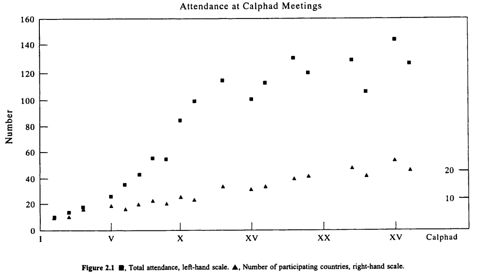

## Chapter 2 - History of CALPHAD

## 2.1. INTRODUCTION

The history of CALPHAD is a chronology of what can be achieved in the field of phase equilibria by combining basic thermodynamic principles with mathematical formulations to describe the various thermodynamic properties of phases. The models and formulations have gone through a series of continuous improvements and, what has become known as the CALPHAD approach, is a good example of what can be seen as a somewhat difficult and academic subject area put into real practice. It is indeed the art of the possible in action and its applications are wide and numerous.

The roots of the CALPHAD approach lie with van Laar (1908), who applied Gibbs energy concepts to phase equilibria at the turn of the century. However, he did not have the necessary numerical input to convert his algebraic expressions into phase diagrams that referred to real systems. This situation basically remained unchanged for the next 50 years, especially as an alternative more physical approach based on band-structure calculations appeared likely to rationalise many hitherto puzzling features of phase diagrams (Hume-Rothery et al. 1940).

However, it became evident in the post-war period that, valuable as they were, these band-structure concepts could not be applied even qualitatively to key systems of industrial interest; notably steels, nickel-base alloys, and other emerging materials such as titanium and uranium alloys. This led to a resurgence of interest in a more general thermodynamic approach both in Europe (Meijering 1948, Hillert 1953, Lumsden 1952, Andrews 1956, Svechnikov and Lesnik 1956, Meijering 1957) and in the USA (Kaufman and Cohen 1956, Weiss and Tauer 1956, Kaufman and Cohen 1958, Betterton 1958). Initially much of the work related only to relatively simple binary or ternary systems and calculations were performed largely by individuals, each with their own methodology, and there was no attempt to produce a co-ordinated framework.

## 2.2. THE EARLY YEARS

Meijering was probably the first person to attempt the calculation of a complete ternary phase diagram for a real system such as Ni-Cr-Cu (Meijering 1957). This example was particularly important because mere interpolation of the geometric features from the edge binary systems would have yielded an erroneous diagram. It was also a pioneering effort in relation to the concept of lattice stabilities; Meijering realised that to make such a calculation possible, it was necessary to deduce a value for the stability of f.c.c. Cr, a crystal structure that was not directly accessible by experiment.

His attempt to obtain this value by extrapolation from activity measurements was an important milestone in the accumulation of such lattice-stability values. That these early results have been only marginally improved over the years (Kaufman 1980) is quite remarkable, considering the lack of computing power available at that time. Apart from correctly reproducing the major features of the phase diagram concerned, it was now possible to give concrete examples of some of the thermo- dynamic consequences of phase-diagram calculations. Band theory was stressing the electronic origin of solubility limits, but the thermodynamic approach clearly showed that the solubility limit is not merely a property of the solution concerned but that it also depends on the properties of the coexisting phases and, of course, also on temperature. It was also shown that a retrograde solidus has a perfectly sound explanation, and ‘‘did not fly in the face of natural law’’ (Hansen 1936).

The capacity to give a quantitative description of all the topological features of phase diagrams was to be the crucial issue which ultimately convinced the scientific community of the necessity for a global thermodynamic approach. Developments in the USA were complementary to the work in Europe in several crucial respects. Firstly, the activity was initially linked to practical problems associated with steels (Kaufman and Cohen 1956, 1958). Secondly, there was, from the outset, a vision of producing an extensive database from which phase diagrams could be calculated on a permutative basis. The single-minded determination to combine these two aspects, and to gather together all the major workers in the field on a world-wide basis, must be considered to be the basic driving force for the eventual emergence of CALPHAD. It was, however to take some 15 years before the concept was officially realised.

Such a lengthy incubation period between vision and fruition seems very long in retrospect, but is on par with similar developments in other areas of science and technology. It reflects the time taken for individuals to meet each other and agree to work together and also the time taken for the scientific and technological community to devote adequate funds to any new activity. Thus a conference on the physical chemistry of solutions and intermetallic compounds, convened in 1958 at the National Physical Laboratory, did not lead to any noticeable increase in communal activities, although it did marginally increase a number of bilateral contacts.

In parallel to Kaufman and co-workers in the USA, work was taking place in Sweden stemming from the appointment of Mats Hillert to the Royal Institute of Technology in Stockholm in 1961. Kaufman and Hillert studied together at MIT and Hillert was very keen to make the use of thermodynamic calculations a key feature of the department there. There was also considerable encouragement from both the government and the steel industry for such a programme of work. Long-term funding was made available and in the mid-1960s a group from Tohuku University at Sendai, Japan, were amongst the early workers that took part in this work. They brought with them experimental techniques that were to prove invaluable in validating the early calculations of Hillert et al. (1967). On their return to Japan, these workers, who included Professor Nishizawa, formed another centre which furthered such thermodynamic activities in their home country (Hasebe and Nishizawa 1972, Ishida et al. 1989, Nishizawa 1992).

Work on the characterisation of steels started with quite rudimentary polynomial descriptions of the thermodynamic properties of iron. A more fundamental approach which could include magnetism was developed by (Weiss and Tauer 1956, Tauer and Weiss 1958) and eventually led to a quite sophisticated model (Kaufman et al. 1963). However, magnetic alloys were clearly not the best test vehicle with which to convince a sceptical scientific community of the value of a general thermodynamic approach, although a knowledge of the so-called lattice stabilities was undoubtedly the vital ingredient required to create a viable database. Alloys based on titanium therefore seemed a more likely starting point for the development of a database and a project therefore began with characterisation of Ti and Zr pressure/temperature diagrams (Kaufman 1959a).

The projected database also required lattice stabilities for elements in crystal structures that were sufficiently unstable so as not to appear under attainable combinations of temperature and pressure. The next few years saw the discovery and application of methods for deducing working values of these key parameters (see Chapter 6). In addition, the calculation of phase diagrams also required a complementary set of interaction parameters between the various elements or species in the system. Although these were available for specific systems, the production of a whole set of these parameters would be a time-consuming step. Moreover the situation in iron- base alloys was complicated by the presence of magnetic effects (see Chapter 8). Kaufman therefore decided to test his general methodology on a series of non-magnetic transition metal binary alloys using an ideal solution model, in which the interaction parameters are set to zero (Kaufman 1967). Despite this rather drastic assumption, the work presented at this Battelle meeting constituted the first demonstration of the potential power of the CALPHAD approach.

The use of an ideal-solution model meant that there were a number of instances where calculated and experimental results were quantitatively at variance. However, the approach very successfully predicted the general form of most of the phase diagrams, for example whether they were peritectic or eutectic, and accounted for the appearance of intermediate phases in systems such as Cr-Rh. That the approach could do this using such simple and intemally self-consistent models is a demonstration of the inherent power of CALPHAD methods. The importance of this first step therefore cannot be overestimated, although its significance was not appreciated by many members of the scientific community at the time. In fact these initial results were criticised by both experimentalists and theoreticians. The former considered the calculations too inaccurate and were in general not prepared to consider the potential improvements of using a more elaborate system of interaction coefficients. The latter were mostly concerned with potential errors in the selected values of the lattice stabilities and the supposed superiority of a more fundamental approach based on band structure calculations. These initial criticisms required very persistent refutations and the criticisms from some of the theoreticians were somewhat galling as the band-structure approach at this time had no possibility of handling phase equilibria at anything other than absolute zero.

Not surprisingly, Kaufman found the Battelle meeting discouraging. The values of lattice stabilities proposed by Brewer (1967) were substantially different to those proposed on thermodynamic grounds, but there was at least the possibility of a dialogue on this issue, and so Kaufman (1966a) wrote, in a letter to Brewer, that

.. “There have been the same tired old band theory discussions and little seems to
have happened over the last thirty years; the attendees do not seem to be aware of the
most important directions for attacking the problem."’

Although this attempt to launch the CALPHAD approach in the scientific community at large did not seem to have much success, Kaufman had by this time considerably extended and improved his modelling. He had incorporated regular solutions together with a semi-empirical method for deriving the necessary interaction coefficients from other atomic parameters (see Chapter 6). Details of this procedure were published as an Air Force Contract Report (Kaufman 1959b), but it was clearly desirable to make it available in the open literature. Providentially, letters were being exchanged at this time between Kaufman and Hume-Rothery (Kaufman 1966b) concerning the thermodynamic representation of liquidus and solidus lines in iron-base alloys (Buckley and Hume-Rothery 1963), which resulted in a modified approach by these authors (Sinha and Hume-Rothery 1967). This correspondence evolved into a lengthy discussion on the mode of presentation of thermodynamic equilibria in general, and the difficulties of changing prevailing views in particular, which ended in the commissioning of a review.

Hume-Rothery was to prove a fair, if demanding, editor, and the result was an important review on the stability of metallic phases as seen from the CALPHAD viewpoint (Kaufman 1969). The relevant correspondence provides a fascinating insight into his reservations concerning the emerging framework that Kaufman had in mind. Hume-Rothery had spent most of his life on the accurate determination of experimental phase diagrams and was, in his words (Hume-Rothery 1968), ‘*...not unsympathetic to any theory which promises reasonably accurate calculations of phase boundaries, and saves the immense amount of work which their experimental determination involves”’.

But while Hume-Rothery agreed that increasing accuracy had to be obtained by stages, he held on to his opinion that the calculations being presented were inadequate in many specific cases (e.g Mo-Rh). His view was that while it was immensely valuable to make the calculations and see what happened it would be difficult to persuade him that such calculations represented real progress and that the methodology should be included in the proposed review. Interestingly he concluded (Hume-Rothery 1968) ‘*... however I would like to be convinced of the contrary!’’.

Kaufman took immense pains to restate his position and counter Hume- Rothery’s objections, sensing that this was indeed a crucial watershed in gaining acceptance for his point of view. He agreed that the task of computing phase equilibria accurately was a very difficult one, and that it might even be impossible. Nonetheless it seemed clear that the preconditions for tackling this challenge involved certain axiomatic requirements. Firstly, an emphasis on the competition between all principal phases; secondly, the provision of an explicit description which could be applied to many systems; and thirdly, the availability of a numerical input which could provide a quantitative description applicable over a wide range of temperature, composition and pressure. It was clear that his current description of phase equilibria did not satisfy these requirements perfectly, but it did offer an idealised description of the desired ultimate framework. No previous attempt had simultaneously included lattice stability descriptions for an extensive number of the elements, a generalised treatment of interaction coefficients in terms of group number, size factor and internal pressure contributions, combined together with a suitable Gibbs energy minimisation routine (Kaufman 1968a).

Kaufman (1968b) also made it clear that the use of more realistic descriptions, such as sub-regular solution models, would necessitate the determination of many more parameters and thought that: ‘‘Unti! such time as our knowledge of solution theory and the physical factors which control the properties of solutions might permit these parameters to be determined, it is better to continue with a simpler model.’’ This conclusion was of course also conditioned by the limited computer memory available at the time, which prevented the use of more complex models with the subsequent increase in number of parameters which they entailed.

Throughout the editorial stages of the emerging review it was continually necessary to spell out the differences between (a) the use of an ideal solution model, (b) the use of a regular solution model with parameters derived solely from atomic properties and finally (c) the use of interaction parameters derived by feedback from experiment. A proper understanding of the differences between these three approaches lay at the heart of any realistic assessment of the value of calculations in relation to experimentally determined diagrams.

The discussion between Hume-Rothery and Kaufman also dealt with the apparent conflict between different sets of competing lattice stabilities. It was particularly worrying to him that Brewer (1967) and Engel (1964) proposed values based on spectroscopic data that could differ by almost an order of magnitude in some instances. To an outsider, these were simply alternatives which had equal validity, because the effect of changing such values on phase diagram calculations was not immediately obvious. To Kaufman, with much computing experience behind him, some of the consequences of adopting the Brewer values were totally unacceptable. In particular, Kaufman found difficulty in accepting some of the resulting low melting points for metastable phases and the subsequent requirement that there should be highly composition-dependent interaction parameters in the vicinity of the pure metals (Brewer 1967). All this was aggravated by the fact that the methods used by Brewer and Engel were not transparent enough to allow other workers to make their own calculations. Kaufman was very concerned at the uphill struggle required to establish an acceptable set of lattice stabilities and was disappointed that there had not been a widespread appreciation of this concept (Kaufman 1968c).

Lattice-stability values obtained by electron energy calculations also differed from those obtained by thermochemical routes, but at that time such calculations were still at a relatively rudimentary stage and it was assumed that the two sets of values would eventually be related. However, there is no doubt that lack of agreement in such a fundamental area played a part in delaying a more general acceptance of the CALPHAD methodology.

1970 saw the publication of the first textbook devoted to the quantitative computation of phase diagrams (Kaufman and Bernstein 1970) whose appeal was shown by its translation into several languages, including Russian in 1972. Some reviewers, however, evidently still thought that the approach was much too empirical and had no real physical basis (Walbaum 1972). With hindsight, it is easy to see that the slow acceptance of the emerging CALPHAD technique was due to its attempt to occupy a semi-empirical middle ground, sandwiched between a rigorously physical basis and experimentally determined equilibria. Many scientists were certainly not yet willing to accept that such pragmatism was necessary in order to allow the method to be extended to multi-component systems.

The other major hurdle in the early 1970s was to find a way of tackling the industrially important case of steels. All around the world researchers were being confronted with the need to use markedly non-linear free-energy expressions, which were associated with the magnetism of iron, and there were substantial prob- lems in incorporating such terms into the formalism for non-magnetic alloys used at the time. Although a breakthrough appeared to have been made for the non- magnetic transition elements (Pettifor 1969a, 1969b) by 1971, it was still thought that real progress would not be achieved in this area until more sophisticated band- structure calculations became available (Ducastelle 1971).

In order to progress with steels, it was necessary to pursue semi-empirical methods (Weiss and Tauer 1956, Tauer and Weiss 1958) which culminated in the seminal paper describing the thermodynamics of iron (Kaufman et al. 1963). This included the concept of two different magnetic states for f.c.c. iron, which had been applied to rationalise the Invar properties of iron-nickel alloys (Weiss 1963). However, this concept was viewed with considerable scepticism. Some support eventually emerged from band-structure calculations (Roy and Pettifor 1977) and the two gamma states hypothesis was shown to have considerable potential in other iron-base alloys (Miodownik, 1977, 1978b). However, at the time it was considered to be too complex to merit inclusion in the general thermodynamic framework. Although the basic foundations of CALPHAD were being laid in these formative years, the necessary ideas were still essentially being exchanged by correspondence, with isolated cases of personal contact. The number of papers in this field was however increasing slowly but surely, and three closely spaced meetings, at Brunel and Sheffield in 1971 and Munich in 1972, eventually provided an opportunity for the correspondents from different groups to meet each other personally. These meetings confirmed and crystallised the need for a dedicated forum that could deal solely with the emerging topic of computer-aided calculation of phase diagrams. In order to facilitate funding, the international nature of the proposed meetings and the idea of rotating meetings were stressed from the outset. An initial bilateral agreement to generate official meetings between French and American experts in this field was drafted (Kaufman 1973a) and invitations simultaneously extended to representatives from the UK, Sweden and Germany. It is interesting to note both the clarity with which the objectives were defined (Kaufman and Ansara 1973) and the fact that these objectives still form part of current CALPHAD activities today:

“We are at present all using different computer methods to obtain tie-line solutions. We are also using slightly different formulations for the excess Gibbs energy of solution. In some cases the differences may be more semantic than real, but in any case, if we can all employ equivalent computer programmes, we could concentrate on the problem of defining system parameters in order to achieve universal interchange- ability of results. We believe that substantial progress could be made in a short period of time if we could arrange to work together for one week at one of our facilities to define the problems, disband, carry out some individual activities, and meet again for a week at a second facility to compare results and chart future activities.””

The first meeting was scheduled to take place in Boston in 1973 with the second meeting following at Grenoble in 1974. These meetings, held in a workshop format, were to provide opportunities for intimately exploring the details of phase boundary calculations in addition to assessing the broader problems of data acquisition and representation. The potential benefits to the scientific community of developing a uniform description of phases and generating interchangeable data, as well as the ongoing nature of the suggested meetings, gained financial support from the French Ministry of Foreign Affairs (Ansara 1973), the National Science Foundation of the USA (Reynik 1973) and the National Physical Laboratory (NPL) (Spencer 1973). This set a pattern for future support and established the principle that funds should be available to defray the travel costs of individuals with special expertise and to co-ordinate the efforts of various institutions. Significantly, the original proposal also contained the suggestion that the report covering the first two CALPHAD confer- ences could be used as the basis for a larger workshop on phase-diagram calculations which might follow these meetings. Such a meeting was duly organised by the National Bureau of Standards (NBS) at Gaithersburg in August 1975. Although not organised by the CALPHAD group, this was labelled CALPHAD IV, since it took place shortly after CALPHAD III was held in the UK in April of that year.

The private correspondence associated with setting up the first CALPHAD meeting indicates that the arrival of a new generation of younger personnel, who were more familiar with computing, played an important part in the embryonic CALPHAD. For instance, although specifically invited to the first meeting, Kubaschewski (1973) had by then moved to Aachen and was unsure whether he could make a meaningful contribution: ‘‘Although I am in favour of your CALPHAD Project, I beg you to note that my interests end where those of CALPHAD begin. I make myself largely responsible for the provision of critical and consistent thermochemical data of binary alloy systems.... However if funds could be made available for my new colleague Dr. I. Barin, who is looking after our computer programming, he could attend in my place’’.

The extra computing expertise was of course valuable, but Kaufman was at pains to reply that the objectives set for the CALPHAD group were to couple computational methods with all available thermochemical data and that experience in assessing such data would be invaluable (Kaufman 1973b). Kubaschewski was to join Barin for the second meeting in Grenoble and played a major role in promoting the concept of self-consistent thermodynamic information. The importance of the self-consistency engendered by such coupling is still underestimated by newcomers to the CALPHAD procedure even today. The selection of interaction parameters is always a delicate balance between a purely mathematical treatment and a weighting process which inevitably requires an element of subjective experience.

As the selected values allow predictions to be made on a variety of experimental quantities, for instance heats of solution, vapour pressures, and specific heats as well as the position of phase boundaries, it is important to find a method of optimising the interaction parameters so as to give the minimum deviation with respect to all these properties. A least squares method of optimising data was being developed by Mager ef al. (1972) at Stuttgart and with great generosity was subsequently made freely available to all interested parties prior to its eventual publication (Lukas et al. 1977). This accelerated the characterisation of binary systems substantially and contributed greatly to the goal of integrating a wide range of thermodynamic information. Equally, it also made it clearer to the non-specialist that a fully characterised phase diagram could provide a much wider range of properties than was generally thought possible.

## 2.3, THE INTERMEDIATE YEARS

The 1970s and 1980s proved to be the time when CALPHAD established itself as an accepted tool in the general armoury of materials modelling. While, by necessity, it retained a level of empiricism, there was a continuous attempt throughout this period to provide a more physical basis for the modelling process. The number of people involved in CALPHAD methods was also increasing appreciably and new researchers were to profoundly influence the subject area as a whole.

As a further means of providing long-term financial support, and expand the potential of the CALPHAD methodology, it was also decided to form a non-profit- making organisation (Kaufman and Nesor 1975) that would: ‘‘Undertake to conduct meetings of interested persons, organise and operate seminars and other educational experiences and publish results of research and descriptions of educational programmes.” More specifically, the company was empowered to: “Engage in the activities of research, fund-raising, education, publishing and consulting, insofar as these lead to the further understanding of thermodynamic and thermochemical research and process....’”

CALPHAD Inc. was duly incorporated in Massachusetts in 1975. One of the first fund-raising options to be pursued was the possibility of publishing a journal which would act as a focus for papers in this newly emerging field. This eventually came to fruition with the publication of the CALPHAD journal by Pergamon Press in 1977, The growth of CALPHAD activities was now clearly accelerating and an Alloy Data Centre formed at the NBS included CALPHAD calculations as one of its inputs.

A number of important workers who, up to that time, had been working in relative isolation, now became more involved in CALPHAD conferences and publications. The Canadian group, led by Pelton, had evolved is own representation of thermodynamic quantities in a specific set of non-metallic systems (Pelton and Flengas 1969, Pelton and Schmalzried 1973, Bale and Pelton 1974) but found that many of the concepts being outlined for alloys could also be applied in their area. This was to eventually lead to a Facility for Analysis of Chemical Thermodynamics (F*A*C*T) (Bale and Pelton 1979) and the foundation of the Centre of Research for Thermodynamic Calculations at Montreal. In due course there would be further collaboration (Thompson et al. 1983) between F*A*C*T and the SOLGASMIX programme of Eriksson (1975).

By 1976 it was becoming clear that the increasing volume of results in the field of electronic structure calculations should be brought to the attention of the CALPHAD community. Providentially, a workshop on Electronic Structure and Phase Stability in Metals and Alloys was held later that year at Liége. This gave an opportunity for CALPHAD members to ascertain which physicists could best verbally bridge the gap between a physics-based approach and the more chemically orientated background of most of the CALPHAD practitioners. CALPHAD VI thus became the first meeting to which physicists were invited in order to assess the feasibility of combining data obtained by first-principle calculations with CALPHAD techniques (Pettifor 1977). In a number of ways this meeting started the process of collaborative discussion between CALPHAD practitioners and the physics community, which continues to the present day. At the same time, speakers such as Miedema and Machlin, who had developed semi-empirical techniques for deriving missing interaction parameters (Miedema et al. 1973, 1975, Machlin 1974, 1977), were also invited to explain the background to their methods.

1977 was to provide two significant milestones. The first of these was a major workshop on Applications of Phase Diagrams in Metallurgy and Ceramics jointly organised by a consortium of defence establishments at the NBS. Representatives from leading research and development organisations were invited to address the current need for phase diagram information on a world-wide scale and, although the calculation of phase diagrams formed only a small part of the programme, the importance of the meeting lay in the scale of the projected requirements for multi- component systems. It was clear that such a task could not be tackled by conventional methods on a realistic time-scale and, consequently, suggested priorities included a survey of the status and merits of various predictive methods. Amongst the competitors were the PHACOMP method and various pseudo-potential techniques. PHACOMP is essentially based on the concept that certain types of phases, such as o, occur at a critical values of electron-to-atom ratios or the equivalent number of holes in the d-band. However, PHACOMP requires the input of additional arbitrary parameters which means that, while it has some limited usefulness for the purposes of retrospective systematisation, it has no real predictive power. The various pseudo-potential methods were more soundly based but, at the time, were not concerned with anything beyond simple binary systems. By comparison, the CALPHAD technique appeared much more promising.

Although the NBS meeting was very effective in stimulating funding for the production of more relevant and usable phase diagrams, the same measure of support did not materialise for CALPHAD techniques. The self-consistency arising from coupling thermochemical data with phase equilibria was still not appreciated. The potential of computer calculations was acknowledged, but there remained a general reluctance to accept results for multi-component calculations without a major associated experimental programme. However, an increasing audience was being made aware of a viable alternative to the older, more labour-intensive methods of handling phase equilibria.

The second event of 1977 was the publication of the first volume of the CALPHAD journal, which both acted as a cumulative record of progress in making calculations and as an invaluable depository of validated parameters. The aim of the journal was not primarily to be a vehicle for publicity, but it was very useful to have the first issue of the CALPHAD journal available for distribution at the NBS meeting. There was no mandatory requirement to publish the papers and discussions presented at the CALPHAD conferences in the journal. Nevertheless, subsequent issues in the first year of publication of the CALPHAD journal included several key papers given at previous meetings, together with summaries of these meetings. These included the seminal paper on first-principle calculations by Pettifor (1977) and the publication of the Lukas Programme for the statistical coupling of input from various thermodynamic and phase diagram sources (Lukas ef al. 1977).

In the mid-1970s, the cost of sophisticated computers made it difficult for academic departments to requisition the necessary equipment for dealing with thermodynamic problems. The Royal Institute of Technology was one of the few materials science institutions that acquired a powerful minicomputer as early as 1976. This meant that there was more computing power, and a greater capacity for interactive computing, available in Stockholm than in most other materials departments at that time. This clearly had a major impact on software development. Even so, the limitations of the available memory (128 kilobytes!) made it essential to compress data in a very economical way. There was initially a problem with the language facilities on their NORD 10 computer, but eventually a specially structured architecture was devised which formed the basis for the early versions of the programme known as POLY (Jansson 1984a). At this particular point the Stockholm group also decided to develop their own module for the assessment of experimental data, which eventually led to the creation of the PARROT module (Jansson 1984b).

The CALPHAD conference of 1979 in Stockholm provided a good opportunity to absorb major developments which were taking place in both computing hardware and software. In the late 1970s the extension by Sundman and Agren of the two-sub-lattice model of Hillert and Staffansson (1970) into a general model which could account for multiple sub-lattices and multi-component alloys was being undertaken. This was reported to the conference and details of the model published two years later (Sundman and Agren 1981). As one of the key papers on general modelling, this laid the foundation for a substantial proportion of the CALPHAD assessments that have been made to date. The suite of programmes later to become known as Thermo-Calc was also initiated at this time, and still remains one of the most widely used software packages for thermodynamic computation (Sundman 1991).

In England, a corresponding suite of programmes had evolved at the NPL via early mathematical steps in the 1960s (Kubaschewski and Chart 1965) and led to the development of a commercial module in 1974. At the same time the MANLABS suite of programmes was being developed and marketed in the USA (Kaufman 1974). By 1978 the NPL programmes were marketed as ALLOYDATA and, together with an extensive substance database, were being used for many interesting non-metallic applications (Chart et al. 1980). The programmes were included as part of a more general Metallurgical and Thermo-chemical Data Service (MTDS) at the NPL and after substantial redevelopment in the 1980s they became more generally known as MTDATA (Davies et al. 1991). Further details of these and other programmes can be found in Bale and Eriksson (1990).

One of the driving forces for the formation of CALPHAD was the concept of providing a unified database for use by the various calculation programmes (Kaufman and Ansara 1973). SOLGASMIX (Eriksson 1975) and F*A*C*T, which largely dealt with non-metallic systems (Thompson et al. 1983), had interchange- able file structures and data formats. But this was not the case for most of the programmes, which still tended to have their own specific data format structure. Tomiska (1986a, 1986b) showed that the various polynomial formalisms in use at the time could be transformed mathematically into each other. This meant that transfer of data was possible, providing the data for the elements was consistent, even though different models for excess terms were being used by various centres. However, this was often done on a rather ad hoc personal basis. There was clearly a need to systematise the interchange of data and this led to the formation of a consortium of the major groups in France, Germany, Sweden and the United Kingdom known as the Scientific Group Thermodata Europe (SGTE) (Ansara 1983) and eventually to the publication of a unified database for the elements (Dinsdale 1991). This allowed anyone with a general interest in phase-diagram calculations to use much more consistent elemental data, and interchange data with other people.

1979 marked an important milestone, as these developments had now generated a series of parallel symposia devoted to the application of thermodynamic calculations, held under the umbrella of major national organisations. These included the AIME symposium on the Calculation of Phase Diagrams and Thermochemistry of Alloy Phases at Milwaukee in the USA and the Symposium on the Industrial Use of Thermochemical Data organised by the NPL and the Chemical Society at the University of Surrey in the UK. These meetings served to make a larger audience aware of the potential of the CALPHAD technique, as keynote papers based on proven software developments were given at both meetings.

The primary objective of the Milwaukee symposium was to establish cross-linkages amongst metallurgists and material scientists working in the calculation of phase diagrams and to demonstrate that advances in this field could be readily applied in many areas of physical, chemical and process metallurgy. In this context, the paper by Hillert (1979), on the availability of new methods of presenting data and utilising data, was a significant departure from presenting new models or applications. Although an apparently innocuous subject, this embedded some revolutionary ideas. Up to that time, potential users usually had great difficulty in interpreting conventional ternary diagrams and there was usually a total mental block to considering anything with a larger number of components. It was therefore of great importance to break through this barrier and show the potential user that the required information from a multi-component system could also be extracted and digested in an easily assimilated form. Hillert (1980) used a telling analogy with chess as a means to overcome the reluctance of total newcomers to use the CALPHAD approach:

“When considering what fundamentals are required in order to use thermodynamic data for practical purposes, it may be helpful to consider thermodynamics as a game and to consider the question how one can learn to play that game well. For inspiration, one may first look at another game, the game of chess. The rules are very simple to learn, but it was always very difficult to become a good player The situation has now changed due to the application of computers. Today there are programmes for playing chess which can beat almost any expert. It seems reasonable to expect that it should also be possible to write programmes for ‘playing thermodynamics’, programmes which should be almost as good as the very best thermodynamics expert."”

This approach was very timely, as by now such meetings were attracting industrial interest; of the total attendees at the Surrey meeting, 29% came from academic institutions, 26% from government research institutions and 45% from industry, forming an excellent juxtaposition of application and theory. The meeting was summarised as providing an illustration of the power of reliable databases for technology, databases whose credibility had been established by the professional evaluation of experimental data. It was pointed out that such major codification, condensation and integration of expensively won knowledge not only benefits fundamental science but has also a capability for quantitative interpolation, extrapolation and new directions of understanding (Westrum 1980). This meeting was effectively to be the forerunner of a separate series of international meetings devoted to user applications of phase diagrams, sponsored internationally by various groupings of metallurgical and materials societies in later years.

The next few years saw an increased interest in molten salts and silicates (Pelton and Blander 1984) as well as geological contributions, which were typically concerned with aluminates and spinels (Navrotsky 1983). Geological applications seemed to be an ideal growth area, which was accordingly earmarked for further attention at a future CALPHAD meeting. However, although attention has steadily increased on basic oxide systems, geological applications have remained in abeyance until much more recent times (Shi et al. 1994, 1996). Another notable application in the early eighties was by Eriksson (1983), who demonstrated the scope of the SolGasMix programme by applying it to the planetary condensation of solar gases containing more than 30 elements.

During this period, various aspects of Miedema’s methods for predicting the heat of formation of binary compounds were assembled and eventually published in book form (de Boer et al. 1988). This included the application of the technique to predict the thermodynamic behaviour of some ternary compounds. Whilst only applicable to a restricted set of crystallographic structures, this was nevertheless a significant development, as a common objection to the CALPHAD approach was that the existence of ternary compounds could never be predicted solely from binary data.

Another area which saw increasing attention was semiconductor materials. Ishida et al. (1989) constructed a database which combined the calculation of phase equilibria in I1I-V compounds with the calculation of band gaps in the same systems. This was to be the forerunner of future attempts to expand the database beyond the basic thermodynamic information needed for phase diagram calculations, while (Mohri et al. 1989) introduced the effect of an elastic component into such calculations in the same subject area.

The 1980s also saw systematic attempts to couple thermodynamics and kinetics in concentrated alloys. In contrast to geological applications, this field was to blossom. At first the main applications were in rapid solidification processing where a number of papers showed how the underlying thermodynamics of a system could control glass-forming ability (Saunders and Miodownik 1985) as well as the metastable crystalline structures formed during vapour deposition (Saunders and Miodownik 1987). Collaborative work begun at this time between the Royal Institute of Technology (KTH) in Sweden and the Max Planck Institute (MPI) for Iron Research at Diisseldorf led to the development of a substantial programme called DICTRA, which simultaneously solved both the relevant diffusion and thermodynamic equations which control phase transformations in both the liquid and solid states (Agren 1992).

Despite all these advances there remained a surprising resistance to the general acceptance of CALPHAD techniques in many quarters. As there was no shortage of validated applications, it was thought that the reason might be connected with deficiencies in the conventional methods by which phase diagrams had been taught to the past generation of students. Teaching each class of diagram by rote, as well as being exceedingly time consuming and topologically complicated if extended beyond binary systems, rarely produced any real appreciation of phase equilibria. The use of computational techniques as a teaching aid was therefore placed on the agenda, and it was shown that suitable software could certainly make the conventional methods much more interesting and efficient (Hayes 1984). However, a more radical approach was made by Hillert (1984), who suggested that the conventional approach should be abandoned altogether and replaced by the direct calculation of any desired critical temperatures and volume fractions. This raised considerable controversy at the time but in fact was probably a correct diagnosis of future trends.

CALPHAD XIV, which was organised on the Campus of MIT at Massachusetts in 1985, emphasised the growing dichotomy between phase stabilities calculated by electron energy methods and the values that were currently used by the CALPHAD community. On the one hand the latter could point to the fact that their values were self-consistent and also produced excellent agreement with experimental results even in multi-component systems. On the other hand the physics community was now extremely confident of the theoretical background for their values of the phase stabilities at 0 K. The debate was continued a few months later, before a wider audience, at a symposium on computer modelling of phase diagrams organised by AIME in Toronto.

A paper by Miodownik (1986) suggested that significant changes in some of the thermochemical parameters could be obtained by adopting different entropies of fusion for the metastable states of certain elements such as tungsten. This approach was more fully explored by Saunders et al. (1988) who attempted a self-consistent reappraisal of Kaufman’s original values and showed how recent experimental information on entropies of fusion could alter Kaufman’s values for lattice stabilities to magnitudes significantly closer to ab initio values. This process used metastable melting points for different crystal structures of the elements which were still very close to those used by Kaufman, and a flurry of papers followed (see Chapter 6) which placed limits on the values for phase stability that could still lead to acceptable phase diagrams. While clearly bringing the two sides closer together, significant discrepancies still remained between a thermochemical and ab initio approach to the lattice stabilities of specific elements. The desirable goal of a single set of lattice stabilities acceptable to both communities was therefore still not in place.

It now looks as though all the outstanding discrepancies between thermochemical (TC) and first-principle (FP) lattice stabilities are associated with cases where the postulated metastable allotrope is mechanically unstable to shear and would spontaneously collapse at 0 K (Craeivich et al. 1994); a possibility previously suggested by Pettifor (1988). This means that it is no longer meaningful to compare the TC and FP values at 0 K unless it is also possible to derive an expression for the anomalous entropy of such systems (Fernandez Guillermet et al. 1995). The use of extrapolated TC lattice stabilities for phase-diagram calculations has remained justifiable, with tighter definitions. The main challenge now lies in properly formulating the temperature dependence for the lattice stabilities obtained by FP calculations. Until this problem has been solved it is clear that phase-diagram calculations from ‘first principles’ will not, in general, be able to match the accuracy obtained by more conventional CALPHAD techniques. In the meantime a simple but entirely empirical treatment (Chang et al. 1995) has already shown that the two treatments are consistent with each other once a suitable expression for the entropy has been formulated.

## 2.4, THE LAST DECADE

The most obvious sign that CALPHAD had finally been accepted, was the number of papers included in a series of internationally organised meetings devoted to emphasising the applications of phase diagrams. The first such meeting was held in 1986 at Orlando, USA, followed by one at Petten, Holland, in 1991, with a third meeting at Rosemount, USA, in 1994. Proceedings of these conferences were published and provide good examples of theory and practice being combined (Kaufman 1987, Hayes 1991, Nash and Sundman 1995). All such meetings exposed the subject to a much wider audience , while new techniques and new fields of potential application were being explored inside the continuing series of annual CALPHAD meetings. Practical questions of measuring thermodynamic properties were gradually being left to a third set of biannual international meetings on the thermodynamics of alloys. The CALPHAD approach was also beginning to feature in physics-based meetings such as the NATO conference on the statics and dynamics of phase transformations, which was held in Rhodes almost simultaneously with the Jerusalem meeting. This was probably the first time that an audience of physicists had been given a thorough overview of the CALPHAD approach, especially the insistence on self-consistency obtained by coupling different forms of thermodynamic and experimental information (Miodownik 1994, Inden 1994).

As far as the mainstream CALPHAD meetings were concerned, 1987 and 1988 saw separate sessions given to semiconductor systems and surface equilibria, with a greater emphasis being placed on oxides and ceramics, including the now popular ceramic super-conducting systems. One of the advantages of a first-principles approach is that one can study the effect of small distortions, so that it also becomes possible to approach the energetics of shear transformations and non-equilibrium effects such as the martensite transformation. For the first time a CALPHAD conference contained a whole session devoted to this topic and this included an application in the field of the new ceramic superconductors based on the YBCO (yttrium-barium-copper-oxygen system), showing how rapidly phase equilibrium calculations were adapting to current systems of topical interest.

In 1990 CALPHAD XIX took place immediately before the international conference on user aspects of phase diagrams at Petten. This was the first time a CALPHAD meeting was located in Holland, although a strong group had been attending from that country ever since CALPHAD III. This meeting was organised jointly by the University of Utrecht and Philips Research Laboratories. The background of these organisers ensured that, for the first time, there was a substantial number of presentations devoted to organic systems (e.g., Oonk ef al. 1986) and there was also a greater emphasis on associated physical properties (Grimwall et al. 1987).

The next two CALPHAD meetings were both affected to some extent by world events outside the control of the organisers. CALPHAD XX took place in India at Jamshedpur in 1991 at a time which coincided with the onset of the Gulf War, and this severely restricted attendance. The 1992 CALPHAD meeting took place in Jerusalem, and while numbers had increased again, they were still affected by residual tensions in the Middle East. However, despite the smaller numbers, these were still very useful and successful meetings. Meetings in Barcelona (1993), Madison (1994), Kyoto (1995) and Erice (1996) saw numbers revert towards the underlying trend of previous years. The growth of the mainstream CALPHAD meetings in terms of both the number of participants and participating countries is shown in (Fig. 2.1).

<em>Attendance at Calphad Meetings</em>

The period has been marked by growing interest in CALPHAD techniques outside Europe and America, which was evidenced by the choice of ‘‘Progress in CALPHAD” as the title for the 1992 Honda memorial lecture to the Japanese Institute of Metals (Nishizawa 1992). Several papers dealing with the CALPHAD approach were presented in the same year at the CAMSE (Computer Applications in Materials) meeting in Yokahama, and this resulted in a joint meeting of the two groups at Madison, USA, in 1994, with the next CALPHAD meeting being held in Japan for the first time. In 1995 the institution of the Ringberg workshop on unary systems marked the realisation that a more sophisticated computational framework was needed for the next decade. With this in view a further two such meetings were scheduled for 1996 and 1997.

## 2.5. THE CURRENT STATUS OF CALPHAD

Clearly CALPHAD has now come of age and is at a watershed where complex phase equilibria calculations can now be performed as a routine operation and yet have also been placed on a sound physical basis. Computer programmes exist which can perform complex calculations on a PC and which can therefore be operated at any location without extensive prior expertise. Furthermore, it is possible in many cases to predict phase equilibria in multi-component alloys to a degree which is close to that expected from experiment (see Chapter 10). It is therefore a branch of science that is mature and, indeed, has already entered the next stage of development, which emphasises the need to concentrate on extending its range of applicability.

Solution databases now exist for a number of the major metallic alloy systems such as steels, Ni- based superalloys and other alloy systems, and highly accurate calculation have been made which even a few years ago would have been considered impossible. The number of substance databases are increasing and the numbers of substances they include is reaching well into the thousands. Substance and solution databases are increasingly being combined to predict complex reactions such as in gas evolution in cast-irons and for oxidation reactions, and it is already possible to consider calculations of extreme complexity such as the reactions which may occur in the burning of coal in a industrial power generator or the distribution of elements in meteorites.

In parallel with such endeavours there is a continuing effort to replace empirical treatments by more physically based approaches. There are certainly two areas in which significant advances are likely. Firstly, while it is has for some time been possible to consider a slag system, it remains a goal to fully combine this with models for concentrated metallic solutions which will properly predict complex solid-state reactions. A second area is the modelling of ordered systems. While it is possible to use sub-lattice modelling for systems such as Ni-Al, these techniques still remain for the most part quite empirical. The Cluster Variation Method (CVM) has already achieved wide recognition as one of the methods for the modelling of ordering systems and has the advantages that short-range ordering is properly incorporated. Increasingly available computer power now makes it possible to explore more sophisticated avenues. Although such techniques as the CVM (de Fontaine 1979) and Monte Carlo method (Binder 1986) have a much earlier origin in the physics literature, a significant milestone is rapidly approaching when fundamental treatments of ordering are going to be embedded into phase-diagram calculations instead of just being treated as ordering phenomena per se.

Combined inputs from first principles and statistical mechanics can now yield diagrams which show most of the topological features of the experimental phase diagram (Sanchez 1984, Sigli and Sanchez 1984, Colinet et al. 1985), which is an impressive achievement. However, the time needed to make a full multi-component calculation is still prohibitive. A solution to this problem will also have the benefit that associated properties such as antiphase domain boundary energies, stacking faults, etc., and also the energetics of various metastable ordering states can then also be predicted more accurately.

The main computing advances are likely to come from application-orientated research programmes where CALPHAD methods will become increasingly used as part of larger, more comprehensive modelling programmes (Mahin 1997, Banerjee etal. 1997). One of the most significant features of current CALPHAD methods has been the combining of kinetics and thermodynamics. Thermo-Calc and ChemSage have a common programming interface which can be used by external programmes to provide detailed thermodynamic information. DICTRA is a software package to simulate diffusional transformations which utilises the subroutines of Thermo-Calc in a more closely integrated fashion and is a vital step in the progression of this combined field. There will also be a need for increased computing efficiency, robustness and speed of calculation. As CALPHAD methods become more popular, there will also be a need for an increased degree of user-friendliness and built-in help modules that guide non-specialists to cope with some of the pitfalls that can be associated with more complex equilibria.

The present state of art of CALPHAD is therefore at a high level and it is a very varied and powerful approach to solving problems associated with thermochemistry and phase equilibria. It has been of interest to the present authors to document how a new scientific approach has come to fruition and it echoes a prescient lecture given by Professor Késter on the development of new ideas and concepts in science (Késter 1956). Some excerpts are given below:

"It is fascinating to trace the devious paths a research worker may have followed before he arrived at his final knowledge and discoveries. Sometimes it may be the gradual perfection of experimental apparatus or the systematic pursuit of an idea; on other occasions success may arise from the deliberate solution of a problem only he believes possible at all, or the recognition of the importance of some apparently insignificant factor; it may even be the appreciation of a phenomenon already known, but completely neglected; or again success may come simply by sudden inspiration, or as the outcome of a long, patient and plodding series of experiments.”’...

“But one thing is common to all true research. Its results are won in the course of unceasing, stubborn wrestling with problems in the service of knowledge.’”’... ‘For each deeper insight, each original discovery, arises not only from cool calculation but is also the outcome of creative force and imaginative perception."’

The year this lecture was delivered coincided exactly with the point in time when the idea of the CALPHAD was conceived. In retrospect, the excerpts above show that the evolution of the CALPHAD technique is an excellent example of the many factors that enter into the realisation of any new idea.

## REFERENCES

Agren, J. (1992) ISLJ International, 32, 291.

Andrews, K. W. (1956) J. Iron & Steel Inst., 184, 414.

Ansara, I. (1973) Private Communication to Kaufman, L. April 13.

Ansara, I. (1983) Private Communication: Registration of (S.G.T.E) under Ordinance 9-821, September 23, Domaine Universitaire, St. Martin d’Heres Cedex, France.

Bale, C. W. and Eriksson, G. (1990) Can. Met. Quart., 29, 105.

Bale, C. W. and Pelton, A. D. (1974) Met. Trans., 5, 2323.

Bale, C. W, Pelton, A. D. (1979) F*A*C*T User Guide (1st edition). McGill University, Ecole Polytechnique, Montreal.

Bannerjee, D. K., Kattner, U. and Boettinger, W. (1997) Solidification Processing 1997, eds Beech, J, and Jones, H. (University of Sheffield, UK), p. 354.

Betterton, W. (1958) Acta Met., 6, 205.

Binder, A. R. (1986) Monte-Carlo Methods in Statistical Physics, ed. Binder, A. R. (Springer Verlag, Berlin).

Brewer, L. (1967) Acta Met., 15, 553.

Buckley, R. A. and Hume-Rothery, W. (1963) J. Iron & Steel. Inst., 201, 227.

Chang, Y. A, Colinet, C., Hillert, M., Moser, Z., Sanchez, J. M., Saunders, N., Watson, R. E. and Kussmaul, A. (1995) CALPHAD, 19, 481.

Chart, T. G., Dinsdale, A. T. and Putland, F. H. (1980) Industrial Use of Thermochemical Data, ed. Barry, T. I. (Chemical Society, London), p. 235.

Colinet, C., Pasturel, A. and Hicter, P. (1985) CALPHAD, 9, 71.

Craievich, P. J., Weinert, M., Sanchez, J. and Watson, R. E. (1994) Phys. Rev. Lett., 72, 3076.

Davies, R. H., Dinsdale, A. T., Hodson, S. M., Gisby, J. A., Pugh, N. J., Barry, T. I. and Chart, T. G. (1991) in User Aspects of Phase Diagrams, ed. Hayes, F. H. (Inst. Metals, London), p. 140.

de Boer, F. R., Boom, R., Mattens, W. C. M., Miedema, A. R., and Niessen, A. K. (1988) in Cohesion in metals: Cohesion and Structure Vol. 1. (Elsevier Science, Amsterdam), p. 644.

de Fontaine, D. (1979) Solid State Physics, 34, 73.

Dinsdale, A. T. (1991) CALPHAD, 15, 317.

Ducastelle, F. (1971) Private Communication to Kaufman, L. September 17.

Engel, N. (1964) ASM Trans. Quarterly, 57, 619.

Eriksson, G. (1975) Chem. Scripta, 8, 100.

Eriksson, G. (1983) presented at Calphad XII (Liege).

Fernandez Guillermet, A., Ozolins, V., Grimwall, G. and Korling, M. (1995) Phys. Rev. B, 51, 10364,

Grimwall, G., Thiessen, M. and Fernandez Guillermet, A. (1987) Phys. Rev. B, 36, 7816.

Hansen, M. (1936) Bibliography of Alloys. (Springer Verlag, Berlin).

Hasebe, M. and Nishizawa, T. (1972) Bull. Jap. Inst. Metals, 11, 879.

Hayes, F. (1984) Contribution to Calphad XIII, Villard les Lans, France.

Hayes, F. (1985) J. Less Common Metals, 114, 89.

Hayes, F. (1991) User Aspect of Phase Diagrams, ed. Hayes, F. (Inst. Metals, London).

Hillert, M. (1953) Acta Met., 1, 764.

Hillert, M. (1979) in Calculation of Phase Diagrams and Thermochemistry of Alloy Phases, eds Chang, Y. A. and Smith, J. F. (Met. Soc. AIME, Warrendale, PA), p. 1.

Hillert, M. (1980) in Conference on the Industrial Use of Thermochemical Data, ed. Barry,
T. (Chemical Society, London), p. 1.

Hillert, M. and Staffansson, L.-I. (1970) Acta Chem. Scand., 24, 3618.

Hillert, M., Wada, T. and Wada, H. (1967) J. Iron & Steel. Inst., 205, 539.

Hume-Rothery, W. (1968) Private Communication to Kaufman, L. June 20.

Hume-Rothery, W., Reynolds, P. W. and Raynor, J. V. (1940) J. Inst. Metals, 66, 191.

Inden, G. (1994) in Statics and Dynamics of Alloy Phase Transformations, eds Turchi, P. and Gonis, A. (NATO ASI Series B: Physics Vol. 319). (Plenum Press, New York).

Ishida, K., Tokunaga, H., Ohtani, H. and Nishizawa, T. (1989) J. Crystal Growth, 98, 140.

Jansson, B. (1984a) TRITA-MAC 0233, Royal Institute of Technology, S-100 44 Stockholm, ‘Sweden.

Jansson, B. (1984b) TRITA-MAC 0234, Royal Institute of Technology, S-100 44 Stockholm, Sweden.

Kaufman, L. (1959a) Acta Met., 7, 575.

Kaufman, L. (1959b) ManLabs Research Report No. 2.

Kaufman, L. (1966a) Private Communication to Brewer, L. March 25.

Kaufman, L. (1966b) Private Communication to Hume-Rothery, W. May 31.

Kaufman, L. (1967) in Phase Stability in Metals and Alloys, eds. Rudman, P. S. et al. (McGraw-Hill, New York), p. 125.

Kaufman, L (1968a) Private Communication to Hume-Rothery, W. June 25.

Kaufman, L (1968b) Private Communication to Hume-Rothery, W. July 31.

Kaufman, L. (1968c) Private Communication to Hillert, M. November 1.

Kaufman, L. (1969) Prog. Mater. Sci., 14, 55.

Kaufman, L. (1973a) Private Communication to Reynik, R. (NSF). March 29.

Kaufman, L. (1973b) Private Communication to Kubaschewski, O. August 23.

Kaufman, L. (1974) ManLabs-Brochure on ManLabs-NPL Materials Data Bank.

Kaufman, L. (1980) in Conference on the Industrial Use of Thermochemical Data, ed. Barry, T. (Chemical Society, London), p. 215.

Kaufman, L. (1987) User Applications of Phase Diagrams, ed. Kaufman, L. (ASM, Metals Park, OH).

Kaufman, L. and Ansara, I. (1973) Private Communication to Spencer, P. J and Kubaschewski, O. (NPL) and Hillert, M. and Kirchner (KTH), April 30.

Kaufman, L. and Bemstein, H. (1970) Computer Calculations of Phase Diagrams. (Academic Press, New York).

Kaufman, L. and Cohen, M. (1956) J. Metals, 10, 1393.

Kaufman, L and Cohen, M. (1958) Prog. Metal. Phys., 7, 165.

Kaufman, L. and Nesor, H. (1975) Articles of Organisation for Calphad Inc., Mass. November.

Kaufman, L., Clougherty, E, V. and Weiss, R. J. (1963) Acta Met., 11, 323.

Késter, W. (1956) J. Inst. Metals, 85, 113.

Kubaschewski, O. and Chart, T. (1965) J. Inst. Metals, 93, 329.

Kubaschewski, O. (1973) Private Communication to Kaufman, L, August 29.

Lukas, H. L., Henig, E. Th. and Zimmermann, B. (1977) CALPHAD, 1, 225.

Machlin, E. S. (1974) Acta Met., 22, 95.

Machlin, E. 8. (1977) CALPHAD, 1, 361.

Mager, T., Lukas, H. L. and Petzow, G. (1972) Z. Metallkde., 63, 638.

Mahin, K. W., (1997) Advanced Materials and Processes, 151, 20.

Meijering, J. L. (1948) Philips Res. Rept., 3, 281.

Meijering, J. L. (1957) Acta Met., 5, 257.

Miedema, A. R., Boom, R. and de Boer, F. R. (1975) J. Less Common Metals, 41, 283.

Miedema, A. R., de Boer, F. R. and de Chatel, P. F. (1973) J. Phys. F, 3, 1558.

Miodownik, A. P. (1977) in Applications of Phase Diagrams in Metallurgy and Ceramics. NBS special publication 496, Gaithesburg, p. 1479.

Miodownik, A. P. (1978) in Physics and Application of Invar Alloys, Vol. 3, ed. Saito, H. Maruzen, p. 288.

Miodownik, A. P. (1986) in Computer Modelling of Phase Diagrams, ed. Bennett, L. (Met. Soc. AIME, Warrendale), p. 253.

Miodownik, A. P. (1994) in Statics and Dynamics of Alloy Phase Transformations, ed. Turchi, P. and Gonis, A. (NATO ASI Series B: Physics Vol. 319). (Plenum Press, New York), p. 45.

Mohri, T. Koyanagi, K, Ito, T and Watanabe, K. (1989) Jap. J. Appl. Phys., 28, 1312.

Nash, P. and Sundman, B. (1995) Applications of Thermodynamics in the Synthesis and Processing of Materials, ed. Nash, P. and Sundman, B. (TMS, Warrendale, PA).

Navrotski, A. (1983) presented at Calphad XII (Liége).

Nishizawa, T. (1992) Materials Trans. Jap. Inst. Metals, 33, 713.

Oonk, H. A., Eisinga, P. J. and Rouwer, N. B. (1986) CALPHAD, 10, 1.

Pelton, A. D. and Blander, M. (1984) in 2nd Int. Symp. on Metallurgical Slags & Fluxes, eds Fine, A. H and Gaskell, D. R. (Met. Soc. AIME, Warrendale, PA), p. 281.

Pelton, A. D. and Flengas, S. N. (1969) Can. J. Chem., 47, 2283.

Pelton, A. D. and Schmalzried, H. (1973) Met. Trans., 4, 1395.

Pettifor, D. G. (1969a) Private Communication to Kaufman, L. September 8.

Pettifor, D. G. (1969b) J. Phys. C, 2, 1051.

Pettifor, D. G. (1977) CALPHAD, 1, 305.

Pettifor, D. G. (1988) Private Communication to Saunders et al. (1988).

Reynik, R. (1973) Private Communication May 13.

Roy, D. M. and Pettifor, D. G. (1977) J. Phys. F, 7, 183.

Sanchez, F. J (1984) in High Temperature Alloys: Theory and Design, ed. Stiegler, O. (Met. Soc, AIME, Warrendale, PA), p. 83.

Saunders, N. and Miodownik A. P. (1985) CALPHAD, 9, 283.

Saunders, N. and Miodownik A. P. (1987) J. Mat. Sci., 22, 629.

Saunders, N., Miodownik, A. P. and Dinsdale, A. T. (1988) CALPHAD, 12, 351.

Shi, P., Saxena, S. K., Zhang, Z. and Sundman, B. (1994) CALPHAD, 18, 47.

Shi, P., Saxena, S. K., Zhang, Z. and Sundman, B. (1996) CALPHAD, 20, 93.

Sigli, C. and Sanchez, J. M. (1984) CALPHAD, 8, 221.

Sinha, A. K. and Hume-Rothery, W. (1967) J. ron & Steel Inst., 206, 1145.

Spencer, P. J. (1973) Private Communication to Kaufman, L. August 9.

Sundman, B. (1991) User Aspects of Phase Diagrams, ed. Hayes, F. H. (Inst. Metals, London), p. 130,

Sundman, B. and Agren, J. (1981) J. Phys. Chem., 42, 297.

Svechnikov, V. N. and Lesnik, A. G. (1956) Fisika Metallov. Metallovedenie, 3(1), 87.

Tauer, K. J. and Weiss, R. J. (1958) J. Phys. Chem. Solids, 4, 135.

Thompson, W. T., Pelton, A. D. and Bale,C. W. (1983) CALPHAD, 7, 137.

Tomiska, J. (1986a) CALPHAD, 10, 91.

Tomiska, J. (1986b) CALPHAD, 10, 239.

van Laar, J. J. (1908) Z. Physik. Chem., 63, 216; 64, 257.

Walbaum, D. R. (1972) Review of Kaufman and Bernstein (1970) in American Mineralogist (May/June), p. 1009.

Weiss, R. J. (1963) Proc. Phys. Soc., 82, 281.

Weiss, R. J. and Tauer, K. J. (1956) Phys. Rev., 102, 1490.

Westrum, E. F. (1980) in Conference on the Industrial Use of Thermochemical Data, ed. Barry, T. (Chemical Soc., London), p. 416.
