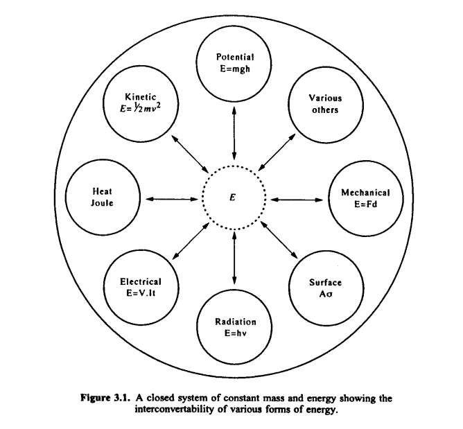
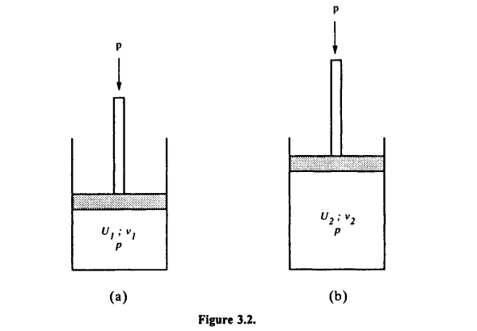
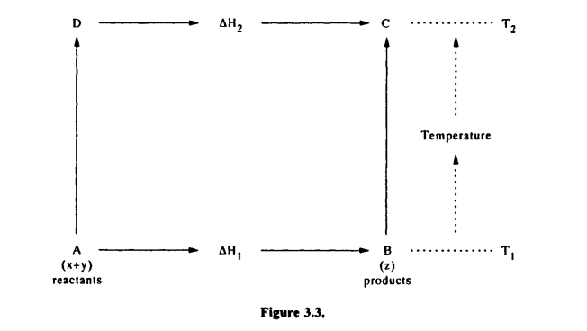

# Chapter 3 - Basic Thermodynamics

## 3.1. INTRODUCTION

Thermodynamics is the science which underpins the CALPHAD method. Although the practice of calculating phase diagrams is computer intensive and relies heavily on mathematical manipulation, it would not be possible to begin without model descriptions of the underlying thermodynamics of the system of interest. A further strength of thermodynamics is that the underlying principles and laws are applicable to any type of system and hence the CALPHAD approach can be used equally well in many disciplines, for example geology, chemical and process engineering, materials science and nuclear technology; the list is very long.

The aim of this chapter is not to go into great depth on this subject but to introduce the reader to the key concepts which will be discussed later in the book. The chapter begins by describing the first and second laws of thermodynamics and introducing the reader to the ideas of enthalpy, entropy and Gibbs energy. There will be examples of how Gibbs energy can be used to indicate the direction of a chemical reaction and how heat evolution can be predicted. The concept of Gibbs energy will then be applied to solution phases, for example liquids, and the concept of partial quantities introduced. The reader will then be introduced to the calculation of phase diagrams using a series of quite simple examples.

## 3.2. THE FIRST LAW OF THERMODYNAMICS

Thermodynamics is concerned with energy and the way energy is transferred. It is a science of the macroscopic world but its effects are applied even at the microscopic scale. The first law introduces the basic thermodynamic concepts of work, heat and energy and can be defined as follows: Energy can neither be created or destroyed in a system of constant mass, although it may be converted from one form to another.

This law is also called the Law of Conservation of Energy. The diagram below (Fig. 3.1), after Mackowiak (1966), represents a system of constant mass and energy which is enclosed in the circle. The arrows represent the interconvertability of the various types of energy. For example, heat energy can be converted to mechanical work, which is the basis of internal combustion engines.

<em>A closed system of constant mass and energy showing the interconvertability of various forms of energy.</em>

If external energy is supplied to the system it must absorb the energy either by increasing its own internal energy and/or by doing work. As energy can neither be created or destroyed, the following relationship is obtained:

$$
\Delta{}U = q - w \quad\text{(3.1)}    
$$

where \\(\Delta{}U\\) is the change in internal energy (defined as the sum of all the kinetic energies and energies of interaction of the particles in the system), \\(q\\) is the heat (or energy) supplied and \\(w\\) is the work done by the system. Some of the fundamental equations of thermodynamics will now be derived.

### 3.2.1 The definition of enthalpy and heat capacity

If \\(q\_{p}\\) joules of energy are introduced to a gas confined in a cylinder at pressure \\(p\\) (Fig. 3.2(a)), the internal energy of the gas increases and to maintain the pressure at a constant \\(p\\) the gas expands (Fig. 3.2(b)).

<em></em>

To keep the pressure constant, the gas has done work by pushing the piston during expansion and this work is given by

$$
w = p\Delta{}v \quad\text{(3.2)}    
$$

where \\(\Delta{}v\\) is the change in volume of the gas. Substituting into Eq. (3.1) gives

$$
\Delta{}U = q\_{p} - p\Delta{}v \quad\text{(3.3)}
$$

or, alternatively

$$
\Delta(U + pu) = q\_{p} \quad\text{(3.4)} 
$$

The term on the left-hand side \\((U + pv)\\) is very important in thermodynamics and is called the *enthalpy*. It is given the symbol \\(H\\). Thus by definition

$$
\Delta{}H = q\_{p} \quad\text{(3.5)} 
$$

An increase in enthalpy therefore denotes the heat absorbed during a process at constant pressure. For the case of constant volume the process is simpler as the system does no work on its surroundings, i.e., \\(p\Delta{}v = 0\\). Therefore,

$$
\Delta{}U = q\_{v} \quad\text{(3.6)} 
$$

where \\(q\_{v}\\) is the heat absorbed by the system with constant volume. The heat capacity of a system, \\(C\\), can now be defined as the quantity of heat necessary to raise a system by a temperature, \\(\delta{}T\\), and can be expressed as a differential

$$
C = \frac{dq}{dT} \quad\text{(3.7)} 
$$

\\(C\\) is temperature dependent and is often described using an empirical formula such as

$$
C = a + bT + cT^{-1} + dT^{-2} \quad\text{(3.8)} 
$$

Equation (3.7) is true for heat capacities at either constant pressure or constant volume. However, the heat capacity will be different if the system is at constant pressure (\\(C\_{p}\\)) or constant volume (\\(C\_{v}\\)). For the case of constant pressure, combining Eqs (3.5) and (3.7) gives

$$
C\_{p} = \frac{dH}{dT} \quad\text{(3.9)} 
$$

and for the case of constant volume, combining Eqs (3.6) and (3.7) gives

$$
C\_{v} = \frac{dU}{dT} \quad\text{(3.10)} 
$$

### 3.2.2 Enthalpy of formation

The enthalpy of formation is defined as the heat evolved or absorbed when an alloy or compound is formed from its elements. For example, in the formation of \\(CO\_{2}\\)

$$
C\_{(s)} + O\_{2(g)} \leftrightarrow CO\_{2(g)}\quad\text{(3.11)}
$$

there is an evolution of heat and such a reaction is termed *exothermic*. In this circumstance the enthalpy of formation is then a negative quantity. Conversely, during the reaction

$$
C\_{(s)} + CO\_{2(g)} \leftrightarrow 2CO\_{(g)}\quad\text{(3.12)} 
$$

heat is absorbed and in this circumstance the reaction is *endothermic*. The enthalpy of formation is then a positive quantity.

### 3.2.3 Hess's law

The enthalpy of formation or reaction can be either measured directly or calculated using Hess's law. This states that the overall change in the enthalpy of a chemical reaction is the same whether it takes place in one step or in several steps. Therefore

$$
\Delta{}H = \Delta{}H\_{1} + \Delta{}H\_{2} + \Delta{}H\_{3} + ... + \Delta{}H\_{n} \quad\text{(3.13)} 
$$

where \\(\Delta{}H_{1,2,3,...,n}\\) are the individual enthalpy changes which take place at each of the steps. This can be used to calculate a heat of reaction in the following way. Suppose that \\(a\\) moles of reactant \\(A\\) and \\(b\\) moles of \\(B\\) react as follows:

$$
aA + bB + \Delta{}H^{\circ} \rightarrow cC + dD \quad\text{(3.14)} 
$$

The heat absorbed/evolved, \\(\Delta{}H^{\circ}\\), during the reaction is given by

$$
a\Delta{}H\_{A} + b\Delta{}H\_{B} + \Delta{}H^{\circ} = c\Delta{}H\_{C} + d\Delta{}H\_{D} \quad\text{(3.15)}
$$

\\(\Delta{}H^{\circ}\\) is then found if \\(\Delta{}H_{A,B,C,D}\\) are known. \\(\Delta{}H\\) is not temperature independent and Kirchhoff's law can be used to define how \\(\Delta{}H\\) varies with temperature.

### 3.2.4 Kirchhoff's law

Figure 3.3 shows how to determine the enthalpy change \\(\Delta{}H\_{2}\\) at \\(T\_{2}\\) starting with a knowledge of a chemical reaction at temperature \\(T\_{1}\\); whose enthalpy change is \\(\Delta{}H\_{1}\\).

<em></em>

By first reacting \\(x\\) and \\(y\\) at \\(T\_{1}\\); and then raising the temperature of the products from \\(T\_{1}\\) to \\(T\_{2}\\), i.e., along \\(ABC\\), the heat absorbed/evolved in the process will be

$$
\Delta{}H\_{1} + \int_{T\_{1}}^{T\_{2}}C\_{p,(z)}dT \quad\text{(3.16)}
$$

The second way of obtaining the same result is to raise the temperature from \\(T\_{1}\\) to \\(T\_{2}\\) and then reacting \\(x\\) and \\(y\\) at \\(T\_{2}\\), i.e., along \\(DC\\). This gives

$$
\int_{T\_{1}}^{T\_{2}}\left(C\_{p,(x)}+C\_{p,(y)}\right)dT + \Delta{}H\_{2}\quad\text{(3.17)}
$$

From Hess's law Eq. (3.16) = Eq. (3.17) and, therefore,

$$
\int\_{T\_{1}}^{T\_{2}}\left(C\_{p,(x)}+C\_{p,(y)}\right)dT + \Delta{}H\_{2} = \Delta{}H\_{1} + \int\_{T\_{1}}^{T\_{2}}C\_{p,(z)}dT \quad\text{(3.18)}
$$

which gives

$$
\Delta{}H\_{2} - \Delta{}H\_{1} = \int\_{T\_{1}}^{T\_{2}} \left[C\_{p,(z)} - \left(C\_{p,(x)}+C\_{p,(y)}\right)\right]dT \quad\text{(3.19)}
$$

with

$$
\Delta{}C\_{p} = C\_{p,(z)} - \left(C\_{p,(x)}+C\_{p,(y)}\right) \quad\text{(3.20)}
$$

where \\(\Delta{}C\_{p}\\), is the difference between heat capacity of product and reactants. Eq. (3.18) can then be written as

$$
\Delta{}H\_{2} = \Delta{}H\_{1} + \int\_{T\_{1}}^{T\_{2}} \Delta{}C\_{p} dT \quad\text{(3.21)}
$$

and often tabulated as

$$
\Delta{}H\_{T} = \Delta{}H\_{298.15} + \int\_{298.15}^{T} \Delta{}C\_{p} dT \quad\text{(3.21a)}
$$

where \\(\Delta{}H_{T}\\) is the enthalpy of formation at temperature \\(T\\) and \\(\Delta{}H\_{298.15}\\) is the enthalpy of formation at 298.15 K.

## 3.3. THE SECOND LAW OF THERMODYNAMICS

The second law of thermodynamics plays a vital part in any reaction, whether this is a simple combustion process or a complex phase transformation in a steel. The first law of thermodynamics considered the heat/work/energy involved in reactions, but this is not sufficient to decide whether a reaction will proceed in any given direction; it is the so-called 'free energy' of a reaction whose sign is crucial.

Take a reversible cycle in a system where \\(p\\), \\(v\\), \\(T\\), etc., change so slowly that the system passes through a series of small, equilibrium, isothermal steps before arriving back to its initial position. Let \\(\delta{}q\_{a}\\) be the heat absorbed during one of these steps when the temperature is \\(T\_{a}\\). It is found experimentally that the sum of \\(\frac{\delta{}q\_{a}}{T\_{a}}\\) for all of the various steps taken during the cycle is equal to zero, i.e.,

$$
\sum\frac{\delta{}q}{T} = 0 \quad\text{(3.22)}
$$

thus \\(\frac{\delta{}q}{T}\\) is a state function. This means that the value of \\(\frac{\delta{}q}{T}\\) depends on the state of the system rather than its history, i.e., its value is independent of the path taken. The name entropy was given to the quantity \\(\frac{\delta{}q}{T}\\) which was given the symbol \\(\Delta{}S\\). It was found that the entropy of a closed system can only increase (in an irreversible reaction) or stay constant (in equilibrium). This is the second law of thermodynamics.

The function which decides whether a process will occur is the free energy change, \\(\Delta{}G\\), where

$$
\Delta{}G=\Delta{}U + p\Delta{}v - T\Delta{}S \quad\text{(3.23)}
$$

and for a reaction to proceed \\(\Delta{}G\\) must be negative. For a process at constant pressure Eq. (3.23) is written as

$$
\Delta{}G=\Delta{}H - T\Delta{}S \quad\text{(3.24a)}
$$

and \\(\Delta{}G\\) is known as the Gibbs energy change of the process. At constant volume (\\(\Delta{}v=0\\)) Eq. (3.23) becomes

$$
\Delta{}F=\Delta{}U - T\Delta{}S \quad\text{(3.24b)}
$$

where \\(\Delta{}F\\) is called the Helmholtz energy.

### 3.3.1 The Gibbs-Helmholtz equation

The Gibbs-Helmholtz equation (Eq. (3.25) below) can be conveniently used to calculate the enthalpy if the rate of change of Gibbs energy with temperature is known. \\(\Delta{}S\\) is obtained from Eq. (3.24a) by differentiating it with respect to temperature, so \\(\frac{d\Delta{}G}{dT}=\Delta{}S\\). Substituting back into Eq. (3.24a) gives the relationship

$$
\Delta{}H=\Delta{}G-T\frac{d\Delta{}G}{dT} \quad\text{(3.25)}
$$

### 3.3.2 Calculation of entropy and Gibbs energy change from heat capacities

From Eq. (3.7) and for the limiting case of an infinitely small step in temperature

$$
\frac{dq}{dT} = C\_{p}\quad\text{(3.26)}
$$

The entropy change is

$$
dS = \frac{dq}{T}\quad\text{(3.27)}
$$

Combining Eqs (3.26) and (3.27) gives

$$
dS = \frac{C\_{p}}{T} dT\quad\text{(3.28)}
$$

If it is assumed that \\(S\_{0}\\) is the entropy at \\(T\\) = 0 K, then the entropy change \\(\Delta{}S\\) in going to temperature \\(T\\) can be calculated from

$$
\Delta{}S = S\_{T} - S\_{0} = \int\_{0}^{T}\frac{C\_{p}}{T} dT \quad\text{(3.29)}
$$

or the absolute entropy at \\(T\\) is given by

$$
S\_{T} = S\_{0} + \int\_{0}^{T}\frac{C\_{p}}{T} dT \quad\text{(3.30)}
$$

In standard tables this is commonly converted to

$$
S\_{T} = S\_{298} + \int\_{298}^{T}\frac{C\_{p}}{T} dT \quad\text{(3.31)}
$$

where \\(S\_{298}\\) is the entropy of the substance at 298 K. It then follows that the Gibbs energy of a substance is given by

$$
G_{T} = H\_{298} + \int\_{298}^{T}C\_{p}dT - T\left(S\_{298} + \int\_{298}^{T}\frac{C\_{p}}{T}dT\right)\quad\text{(3.32)}
$$

### 3.3.3 The physical nature of entropy

Traditional thermodynamics gives a clear definition of entropy but unfortunately does not tell us what it is. An idea of the physical nature of entropy can be gained from statistical thermodynamics. Kelvin and Boltzmann recognised that there was a relationship between entropy and probability (cf., disorder) of a system with the entropy given by

$$
S=k\ln(W)\quad\text{(3.33)}
$$

where \\(k\\) is Boltzmann's constant and \\(W\\) is a measure of the disorder of a system. This means the maximum entropy is associated with the greatest disorder. The consequences of this can be understood by considering a condensed and gaseous phase. The gas has a very high degree of disorder compared to a condensed phase, hence (1) it will absorb more heat and (2) it will become stabilised as the temperature is increased. This concept has profound implications in the field of phase transformations.

## 3.4. THE THIRD LAW OF THERMODYNAMICS

It is more problematical to define the third law of thermodynamics compared to the first and second laws. Experimental work by Richards (1902) and Nernst (1906) led Nemst to postulate that, as the temperature approached absolute zero, the entropy of the system would also approach zero. This led to a definition for the third law of thermodynamics that at a temperature of absolute zero the entropy of a condensed system would also be zero. This was further refined by Planck (1911) who suggested this be reworded as the entropy of a pure element or substance in a perfect crystalline form is zero at absolute zero.

This law is particularly useful as it allows the total entropy of a substance to be obtained if sufficiently low-temperature enthalpy or heat-capacity measurements are available. However, questions remain as to its validity when considering metastable crystalline forms and the law, as stated, would not apply to defect-stabilised structures and amorphous phases.

## 3.5. THERMODYNAMICS AND CHEMICAL EQUILIBRIUM

In a reversible reaction where \\(A\\), \\(B\\), \\(C\\) and \\(D\\) are species consisting of the atoms, molecules, ions, etc., involved in the reaction, the chemical reaction can be expressed by the equation \\(A + B \leftrightarrow C + D\\). In this case the forward arrow represents the reaction proceeding from left to right and backward arrow the reverse reaction. It is possible for the reaction to occur in either direction and the extent to which this occurs depends on the temperature.

For instance, at room temperature when two moles of hydrogen gas (\\(H\_{2}\\)) react with one mole of graphite (\\(C\\)), there is a complete conversion of the reactants into one mole of methane gas (\\(CH\_{4}\\)). However, if the reaction is carried out at high temperatures and constant pressure, it is found that the reaction does not proceed to completion and even after a prolonged time at that temperature and pressure, some hydrogen gas and graphite remain. The reaction thus reaches a state of chemical equilibrium where the rates of forward and reverse reactions are equal and a dynamic equilibrium is reached.

### 3.5.1 The law of mass action and the equilibrium constant

The law of mass action states that the velocity of a reaction at a given temperature is proportional to the product of the active masses of the reacting substances. To illustrate this law consider the reaction

$$
A + B \leftrightarrow C + D
$$

According to the law of mass action the rate of forward reaction (\\(v\_{1}\\)) is proportional to the product of the active masses of \\(A\\) and \\(B\\) denoted \\([A]\\) and \\([B]\\)

$$
v\_{1} = k\_{1}[A][B]\quad\text{(3.34)}
$$

Similarly the rate of reverse reaction (\\(v_{2}\\)) is

$$
v\_{2} = k\_{2}[C][D]\quad\text{(3.35)}
$$

where \\(k\_{1}\\) and \\(k\_{2}\\) are proportionality constants. Since the equilibrium is a dynamic one, i.e., \\(v\_{1}=v\_{2}\\), then we have

$$
k\_{1}[A][B] = k\_{2}[C][D]\quad\text{(3.36)}
$$

and thus

$$
\frac{k\_{1}}{k\_{2}}=\frac{[C][D]}{[A][B]}=K\quad\text{(3.37)}
$$

where \\(K\\) is the equilibrium constant of the reaction at constant temperature. In general for any reversible reaction \\(aA + bB \leftrightarrow cC + dD\\)

$$
K\_{c}=\frac{[C]^{c}[D]^{d}}{[A]^{a}[B]^{b}}\quad\text{(3.38)}
$$

These concentration terms refer to the values at equilibrium and \\(K\_{c}\\) is denoted the *concentration equilibrium constant*. An example of this expression can be appreciated by considering the following chemical reaction which occurs in an aqueous solution

$$
Na\_{2}CO\_{3} + CaCl\_{2} \leftrightarrow CaCO\_{3} + 2 NaCl
$$

Here the values of \\(a\\), \\(b\\) and \\(c\\) are equal to 1 and \\(d\\) is equal to 2. \\(K\_{c}\\) therefore is given by

$$
K\_{c}=\frac{[CaCO\_{3}]^{1}[NaCl]^{2}}{[Na\_{2}CO\_{3}]^{1}[CaCl\_{2}]^{1}}\quad\text{(3.39)}
$$

The equilibrium constant then gives information on how far the reaction has proceeded. If the reaction has proceeded almost to completion the equilibrium constant is large, while if little reaction has occurred it is small. In general three equilibrium constants may be used in reactions according to the ways in which the active masses are expressed:

- (a) \\(K\_{c}\\) = the concentration equilibrium constant where \\([A]\\), \\([B]\\), ..., etc., are given in terms of the molal concentration of the species as shown above. This is usually used for aqueous solutions.

- (b) \\(K\_{p}\\) = the pressure equilibrium constant where \\([A]\\), \\([B]\\), ..., etc., are given in terms of the partial pressures of the species as shown above. This is used for reactions involving gaseous species.

- (c) \\(K\_{a}\\) = the equilibrium constant expressed in terms of activities of the species and can be used for gases, solids or liquids.

The above example considered a homogeneous reaction where all of the reactants and products are in the same state, i.e., in an aqueous solution. However, many reactions involve mixtures of gases, liquids, solids, etc. In this case they are defined as heterogeneous reactions.

## 3.5.2 The Van't Hoff isotherm

Consider a reaction taking place at constant temperature and pressure as defined by

$$
aA + bB + ... \leftrightarrow cC + dD + ...
$$

where \\(A\\), \\(B\\), \\(C\\), etc., are species in a reaction and \\(a\\), \\(b\\), \\(c\\), etc., are the moles of the species in question. The general Gibbs energy change of the reaction is given by the difference in the partial Gibbs energies of the reactants and the products and defined below as

$$
G=\left(c\bar{G}\_{C} + d\bar{G}\_{D} + ...\right) - \left(a\bar{G}\_{A} + b\bar{G}\_{B} + ...\right)\quad\text{(3.40)}
$$

It is usual to give the Gibbs energies with respect to the standard states of the species (\\(G^{\circ}\_{A,B,C,D,...}\\)). The standard state of the species is simply its stable form at the temperature of interest and \\(G^{\circ}\\) is simply the Gibbs energy of the species in its stable state. For example, water is solid (ice) below 0°C and \\(G^{\circ}\_{H\_{2}O}\\), would be the Gibbs energy of ice, while above 100°C \\(G^{\circ}\_{H\_{2}O}\\), refers to the Gibbs energy of water. By definition a gas is in its standard state when its pressure is 1 atm, Equation (3.40) can then be rewritten as

$$
G-G^{\circ}=\left(c\bar{G}\_{C} + d\bar{G}\_{D} + ...\right) - \left(a\bar{G}\_{A} + b\bar{G}\_{B} + ...\right)\quad\text{(3.41)}
$$

where \\(G^{\circ}\\) is the standard Gibbs energy change associated with the reaction and \\(G^{\circ}\_{A,B,C,D,...}\\) is the partial Gibbs energies of the species \\(A\\), \\(B\\), \\(C\\), \\(D\\), ... with respect to their respective standard states. Substituting from Eq. (3.57) for AG (see section 3.6.2) gives

$$
G-G^{\circ}=\left(cRT\ln(a\_{C}) + dRT\ln(a\_{D}) + ...\right) - \left(aRT\ln(a\_{A}) + bRT\ln(a\_{B}) + ...\right)\quad\text{(3.42)}
$$

using the identity \\(x\ln(y) = \ln(y^{x})\\) and \\(\ln(x)-\ln(y)=\ln(x/y)\\), Eq. (3.42) can be rewritten as

$$
G-G^{\circ}=RT\ln\left[\frac{a^{c}\_{C}a^{d}\_{D}...}{a^{a}\_{A}a^{b}\_{B}...}\right]\quad\text{(3.43)}
$$

In the equilibrium state the reactants and products are in equilibrium with each other (i.e. \\(G=0\\)) and the activity product given in the brackets is the equilibrium constant \\(K\\). The standard Gibbs energy of the reaction (\\(G^{\circ}\\)) is therefore

$$
G^{\circ}=-RT\ln(K\_{a})\quad\text{(3.44)}
$$

A practical example of the use of this relationship is in the oxidation of metals. Taking the reaction

$$
Me\_{(s)} + O\_{2(g)} \leftrightarrow MeO\_{2(s)}
$$

the standard Gibbs energy change of the reaction at temperature \\(T\\) is then given by

$$
G^{\circ}=-RT\ln\left[\frac{a\_{MeO\_{2}}}{a\_{Me}a\_{O\_{2}}}\right]\quad\text{(3.45)}
$$

As \\(Me\\) and \\(MeO\_{2}\\) are pure species in their standard states, by definition their activities are equal to 1 and as the activity of \\(O\_{2} = \frac{p\_{O\_{2}}}{p\_{O\_{2}^{\circ}}}\\) Eq. (3.45) becomes

$$
G^{\circ}=-RT\ln\left[\frac{p\_{O\_{2}}^{\circ}}{p\_{O\_{2}}}\right]\quad\text{(3.46)}
$$

As the standard state of \\(O\_{2}\\) is 1 atm this further reduces to

$$
G^{\circ}=-RT\ln\left[\frac{1}{p\_{O\_{2}}}\right]
$$

Values for \\(G^{\circ}\\) are known for various oxidation reactions and can be plotted on diagrams called **Ellingham diagrams** as shown in Fig. (3.4). Such diagrams are very useful to predict reactions associated with oxidation and reduction.

## 3.6. SOLUTION PHASE THERMODYNAMICS

In many cases the CALPHAD method is applied to systems where there is solubility between the various components which make up the system, whether it is in the solid, liquid or gaseous state. Such a system is called a solution, and the separate elements (i.e., Al, Fe. ..) and/or molecules (i.¢., NaCl, CuS. ..) which make up the solution are defined as the components. The model description of solutions (or solution phases) is absolutely fundamental to the CALPHAD process and is dealt with in more detail in chapter 5. The present chapter will discuss concepts such as ideal mixing energies, excess Gibbs energies, activities, etc.

<em>Figure 3.4, Ellingham diagram showing standard Gibbs energy of formation of various oxides as a function of temperature.</em>

### 3.6.1 G ibbs energy of binary solutions

#### 3.6.1.1 Ideal mixing.

First take the example of a crystal with a total of N sites
available for the occupation of atoms or molecules, n of which are occupied by A
atoms/molecules and (NV — n) are occupied by B atoms/molecules. In this case it
can be shown that the total number of ways of distributing them (W) is given by

(3.47)

some of which are shown diagrammatically below (Fig. 3.5) where 1 atom/molecule
of B mixes with 8 atoms/molecules of A.

<em>Figure 3.5. Schematic representation of random mixing of atom/molecule of B in A.</em>

In this case it is clear that the number of configurations the system can adopt
depends on the number of possible positions in which the B atom or molecule can
place itself. Replacing W in Eq. (3.47) gives

S=k. tote a a aN = al (3.48)
Using Stirling's approximation Eq. (3.48) becomes
S = k[N log, N — nlog,n — (N —n) log,(N — n)]. (3.49)

As the mole fractions of A and B are given by tg =(N—n)/N and 1 =n/N
respectively, Eq. (3.49) reduces to

S = —Nk(zq log, zp + 1 log, 2») = —R(Zq log, x» + 24 log, 24) (3.50)

as R = Nk. This then defines the ideal entropy change on mixing. If there are no
repulsive or attractive interactions between atoms A and B the solution is called
ideal and the Gibbs energy of mixing is given by

Gideel — RT (xq log, 2 + 1 log, 25). (3.51)

#### 3.6.1.2 Non-ideal mixing.

In reality there are mixing energies associated with attractive and repulsive interactions between A and B atoms and a further excess mixing energy, G,, must be considered. The simplest way to consider these interactions is via the regular solution model. In this case

GB, = 2424.0 (3.52)

where 2 is the regular solution interaction energy parameter and is related to the energies of the bonds between A and B atoms. When 0 is positive this is equivalent to repulsive interactions and negative values of © are associated with attractive interactions. Equations (3.51) and (3.52) can be combined to give

Gaix = Ta} 2 + RT (aq log, tp + Zp log, 75). (3.53)

In the case of a system such as Fe-Ni, 22 is negative and this, combined with the ideal entropy, produces a smoothly changing curve with a single minimum (Fig. 6(a)). In this case a continuous solid solution is formed, i.e., Ni and Fe mix freely in the f.c.c. lattice. However, for the case of a system such as Cu~Ag, 92 is quite strongly positive. In this case the addition of the ideal entropy produces a Gibbs energy curve with two minima, one at the Cu-rich end the other at the Ag-rich end (see Fig. 3.6(b) below).

The consequence of the positive interactions is that alloys which lie between 2) and z2 can lower their Gibbs energy by forming two-phase structures. One phase which is A-rich with composition <) and the other which is B-rich with composition

<em>Figure 3.6, Gibbs energy vs composition diagrams of A-B systems showing the effect of (a) attractive and (b) repulsive interactions.</em>

2. The lowering of Gibbs energy, by forming multi-phase structures rather than a
series of continuous solutions, is the reason for some of the fundamental features of
alloy phase diagrams and will be discussed later in section 3.7.

### 3.6.2 Partial Gibbs energy and activity in binary solutions

When the components A and B mix as a continuous solution, the Gibbs energy of the alloy at any composition is given by Eq. (3.53). However, another fundamental quantity which arises from the mixing of A and B is the partial Gibbs energy of mixing. Gnix at any composition is related to the partial Gibbs energy of A and B in the solution by the relationship

Gmix = ZaGa + 2G (3.54)

where G, and Gy are the partial Gibbs energies of A and B in the solution given with respect to the Gibbs energy of pure A or B respectively. Because of this Gmix is often called the integral Gibbs energy of mixing. The relationship between the quantities is shown graphically below (Fig. 3.7).

The partial Gibbs energy is then related to the derivative of the Gibbs energy vs composition curve, i.e., the change in Gibbs energy as A or B is added to the alloy in question. If G.» is negative the A or B atoms are readily bound in the solution. However, if AG, or AG; is positive there is a tendency for A or B atoms to disassociate themselves from the solution. The effect of this is shown in the activity of A or B in the solution which can be defined as

Pi
q Pe (3.55)

<em>Figure 3.7. Gibbs energy vs composition diagrams of an A-B system showing
relationship between partial and integral Gibbs energies.</em>

where a; is the activity of the component i in the solution, p; is the measured vapour pressure of i above 1 mole of the alloy and p? is the standard vapour pressure of 1 mole of the component i. It therefore follows that the activity of the pure component i is equal to 1. In an ‘ideal' solution where no interactions exist between A and B

pices! = a; p? (3.56)
and the activity is given simply by
aides! — a, (3.57)
The plot of activity vs composition is then a straight line as shown in Fig. 3.8 for
the activity of B in a solution of A and B.

However, if the B atom is bound into the solution because of negative interactions (ie., 2 — ve) the vapour pressure of B above the alloy is less than if the mixing was ideal. In this circumstance there is a negative deviation from ideality and the plot of activity vs composition is as shown in Fig. 3.9(a). In the case where there are positive interactions ( + ve) there is a positive deviation from ideality as shown in Fig. 3.9(b), and the vapour pressure of B is greater than if mixing is ideal.

The activity is related to the partial Gibbs energy by the relationship

i; = RT log,(a;) (3.58)
and in an ideal solution where a; = x;, Eq. (3.58) becomes

<em>Figure 3.8. Activity vs composition diagrams of an A-B system showing
ideal behaviour of B in A.</em>

<em>Figure 3.9. Activity vs composition diagrams of an A-B system showing (a)
negative and (b) positive deviation from ideality.</em>

Giaeat = RT log,(2;)

(3.59)

The relationship between Eqs (3.58) and (3.59) then allows calculation of the partial excess energy of mixing of i arising from non-ideal interactions as

GP = RT log.(a:) — RT log, (xi)

(3.60)

or

Ai a;
GF = RT bog, (2) . (3.61)

The term (a;/2;) is called the activity coefficient. Methods of measuring the activity and activity coefficient are given in Chapter 5. Tabulations of Gibbs energies of mixing of numerous systems defined in various ways are available in standard reference books, such as Hultgren et al. (1973) and Kubaschewski et al. (1993).

## 3.7. THERMODYNAMICS OF PHASE EQUILIBRIA AND SOME SIMPLE CALCULATED PHASE DIAGRAMS

A phase diagram is often considered as something which can only be measured directly. For example, if the solubility limit of a phase needs to be known, some physical method such as microscopy would be used to observe the formation of the second phase. However, it can also be argued that if the thermodynamic properties of a system could be properly measured this would also define the solubility limit of the phase. The previous sections have discussed in detail unary, single-phase systems and the quantities which are inherent in that system, such as enthalpy, activity, entropy, etc. This section will deal with what happens when there are various equilibria between different phases and includes a preliminary description of phase-diagram calculations.

Figure 3.10(a) shows one of the simplest forms of phase diagram, a system with a miscibility gap. It is characterised by a high-temperature, single-phase field of a

<em>Figure 3.10. (a) Phase diagram for an A-B system showing a miscibility gap and (b) respective G/x curves at various temperatures.</em>

which separates into a two-phase field between a; and a below a critical temperature of 900 K. This occurs because of the repulsive interactions between the components A and B. The Gibbs energy diagrams at different temperatures (Fig. 3.10(b)) show that at higher temperatures the G/x diagram is smooth, exhibiting a single minimum, while at lower temperatures it exhibits a central ‘hump' and the formation of two distinct minima. While a single minimum exists, the Gibbs energy of the alloy is always at its lowest as a single phase. However, below 900 K the system has further possibilities to lower its Gibbs energy.

Figure 3.11 shows the G/x diagram at 600 K. If an alloy of composition zo were single phase it would have a Gibbs energy Go. However, if it could form a mixture of two phases, one with composition z/,, and the other with composition Toys it could lower its total Gibbs energy to G', where G' is defined by the equation

zo — zi, zl — 29
= ag Om tg Om (3.62)

‘a a ~ Tay
and Gi, and Gj, are respectively the Gibbs energies of a at composition z/,, and

“a further separation to compositions 14, and x4, sees a further reduction of the Gibbs energy of the two-phase mixture to G”. This process can continue but is limited to a critical point where the compositions correspond to ae and aE where any further fluctuation in the compositions of the two phases causes the Gibbs energy of the mixture to rise. This point is then a critical position and the phases ay

<em>Figure 3.11. G/x diagram at 600 K for A-B system shown in Fig. 3.10(a) showing separation of a single-phase structure into a mixture of two phases.</em>

and a2 with compositions ae and ae respectively are defined as being in equilibrium with each other. At this point it is convenient to define the fraction of each phase using the equation

aE — a9
No, = —2-— (3.63a)
wae a8,
and
_ gE
Noy = =o au (3.63b)

m3 ah
where NE and NE are the number of moles of a and a respectively.

This critical position of equilibrium can be defined in two fundamentally different ways. The first is that the system A-B with composition 2 has reached an equilibrium where its Gibbs energy is at a minimum. The second definition is that phases a and a2 with compositions 2% and z® are in equilibrium because the chemical potentials of A and B are equal in both phases. The importance of these two definitions becomes clearer if we consider how it would be possible to write a computer programme to find z® and 2.

One method would be to use Eq. (3.62) and utilise a Newton-Raphson technique to perform a Gibbs energy minimisation with respect to the composition of either A or B. This has an advantage in that only the integral function need be calculated and it is therefore mathematically simpler. The other is to minimise the difference in potential of A and B in the two phases using the relationships

4 = 64+ (1-24) a4

A
oa (3.64)
dz4
and
6% = 63 + (1-29) a SB (3.65)
B B ‘B, azz, i.

This has added mathematical complexity but it can be a very sensitive parameter for convergence which can be achieved quite rapidly. The calculation of the phase diagram is then achieved by calculating phase equilibria at various temperatures below 900 K and plotting the phase boundaries for each temperature.

When the points in Fig. 3.12 are joined by a line-fitting routine this yields the phase diagram shown in Fig. 3.10(a). In the more general case there is usually equilibria between crystallographically distinct phases. In this case it is necessary to define some reference states. So far only the case of Gibbs energy of mixing has been considered for solution phases. However, when two or more crystal- lographically distinct phases are considered, the Gibbs energy at the ‘end-points' of the mixing curve must be considered. Perhaps the easiest way to consider this is to

<em>Figure 3.12. Calculated phase diagram of an AB system with a miscibility gap.</em>

take a calculation of phase equilibria for Ni~Cu between 1000-1500 K where there
are two phases, f.c.c. and liquid, which form continuous solutions between Cu and
Ni.

To describe the Gibbs energy of this system, the Gibbs energy of Cu and Ni must be described in both the liquid and solid states. This means we must add the reference states for the liquid and f.c.c. phases in pure Cu and Ni, to the mixing energies of the liquid and f.c.c. phases. The Gibbs energy is then described by the general formula

G = Geet + GS, + Gidea! (3.66)

where Gide! is given by Eq. (3.51). Gyer is then a simple linear extrapolation of the Gibbs energies of the liquid and f.c.c. phases using the equations

GIG® = tou GE + ami GEE* (3.67)

and

GI = requ GQ + ami GM (3.68)

where GEES, and CE are the Gibbs energies of the f.c.c. and liquid phases in pure Cu and Ni respectively. More generally the reference and ideal mixing terms may be written as

Gret = ya G (3.69)

where 2; is the mole fraction of component i and G? is the Gibbs energy of the phase in question at pure i. The ideal Gibbs energy of mixing can be written as

Gite! = RTS x; log, 2. (3.70)

The G%,, term is usually more complicated than given in Eq. (3.52) and will take into account non-regular terms such that

n_ ntl
CB. = Dod 212j[0, + (ei — ay) +05 (4-2))*-]. (8.71)
i=) jat+l

Figure 3.13(a) shows the G/x diagram for Ni-Cu at 1523 K with the f.c.c. Ni and Cu taken as the reference states. It can be seen that Ni-rich alloys are more stable in the f.c.c. phase while Cu-rich alloys are more stable in the liquid phase. At some point near the centre of the composition axis, r9, the Gibbs energy of f.c.c. and liquid phases are the same. If this intersection is taken as a start point it can be seen that the Gibbs energy of an alloy of composition zp can lower its Gibbs energy by forming a two-phase mixture of f.c.c. and liquid with the compositions x}, and Ziq respectively (Figure 3.13(b)). Similarly to the case of a miscibility gap, the Gibbs energy of alloy xo can be further minimised until the compositions of the f.c.c. and liquid phases reach zf,.. and xj, respectively, at which point the phases are in equilibrium. This process is then performed over a range of temperatures and the phase diagram plotted as shown in Fig. 3.14.

It can now be seen that if the thermodynamic properties of the liquid and f.c.c. phases could be determined it would be possible to calculate a phase diagram with- out the need for experimental determination of the phase diagram itself. Indeed, this was done by Pascoe and Mackowiak (1970, 1971) more than 25 years ago and the diagram was in good agreement with that observed experimentally. Ni-Cu presents

<em>Figure 3.13. Calculated G/x diagrams for Ni-Cu at 1523 K.</em>

<em>Figure 3.14. Calculated phase diagram for Ni-Cu.</em>

an ideal case-study and in practice it is not usual for such a complete description of the thermodynamic properties of a system to exist. In such circumstances a variety of measurement techniques are used to help develop the thermodynamic models, and how this is done will be discussed in more detail in Chapter 5.

### 3.7.1 Topological features of phase diagrams calculated using regular solution theory

It is instructive to look at how changes in phase diagrams can be produced by systematically varying the regular solution parameter of the Gibbs excess energy of mixing as defined by Eq. (3.52). Such a systematic approach has been previously demonstrated by Pelton (1983) and it is worthwhile discussing the changes and types of diagram in more detail. Figure 3.15 shows a series of calculated phase diagrams based on an A-B system involving two phases, one a solid, the other liquid.

The first row shows the case where large repulsive interactions exist in the solid phase, producing a large miscibility gap, and the liquid regular solution parameter (li) has been varied between -20 and +30 kJ mol”'. The first diagram with Qlia = -20 kJ mol" is characterised by a deep eutectic trough and would be typical of a system such as Au~Si. Such systems are often useful for brazing or soldering applications and can also be good glass formers. As 2 becomes less negative the general topology of the diagram remains similar, even for the case where M4 = +10 kJ mol"! the system is characterised by a eutectic, although it is quite shallow. Such behaviour is typical of systems such as Ag-Bi and Ag-Pb or Cd-Zn and Cd—

<em>Figure 3.15. Topological features of phase diagrams calculated using regular solution theory.</em>

Pb, where retrograde solubility for the solid in equilibrium with the liquid can also occur. As a critical value of "9 is approached the liquid forms its own miscibility gap and the diagram then exhibits two forms of liquid invariant reaction, the lower temperature reaction being either eutectic or peritectic, while the higher temperature reaction becomes monotectic. Examples of such systems are Cu-Pb and Cu-TI. When 2!"4 becomes even larger, the top of the liquid miscibility gap rises above scale of the graph and there is little solubility of either element in the liquid. Such a diagram is typical of Mg systems such as Mg~Fe or Mg-Mn.

The second longitudinal series shows what happens when the regular solution parameter of the solid is made less positive (2°! = +15 kJ mol”). Initially, when M9 js negative, there is little apparent difference from the first series. There is a greater extent of solid solubility, but otherwise the type of diagram is very similar. However, as 24 becomes positive the reaction type changes to become peritectic in nature and is typical of such systems as Ag-Pt and Co—Cu. When 19 reaches +20 kJ mol"! the solid miscibility gap becomes apparent and the shape of the liquidus and solidus looks rather strange, with almost a rectangular appearance. Such a diagram is typical of systems such as Au-Pt, Cu-Rh or Ti-W.

The third and fourth longitudinal series takes the solid interactions to be either ideal, i.e., 2%! = 0, or negative, N°! = -15 kJ mol”!. The form of the diagrams is now completely changed, and they are characterised by complete solubility in the solid phase. The main features to note are (i) minima in the liquid when "9 > Q™, (ii) maxima when 3 < 9%! and (iii) a smooth liquidus and solidus when Oa = Ql,

The above series of calculations helps demonstrate that all types of topology of phase diagrams involving simple liquid and solid solutions can be calculated within the same simple framework, and diagrams with increasing complexity, i.e., increasing number of phases, compounds, allotropic changes in the elements, etc., can also be routinely handled.

## REFERENCES

Nemst, W. H. (1906) Nachr. Ges. Wiss. Gottingen (Math.-Phys. K1), p. 1.

Pelton, A. D. (1983) in Physical Metallurgy: 3rd Edition. eds Cahn, R. W. and Haasen, P. (Elsevier Science, Amsterdam), p. 328.

Pascoe, G. and Mackowiak, J. (1970) J. Inst. Metals, 98, 253.

Pascoe, G. and Mackowiak, J. (1971) J. Inst. Metals, 99, 103.

Planck, M. (1911) Thermodynamik, 3rd Edition. (Veit & Comp., Leipzig), p. 279.

Richards, T. W. (1902) Z. Physikal. Chem., 42, 129.

Mackowiak, J. (1966) Physical Chemistry for Metallurgists. (George Allen and Unwin), London.
