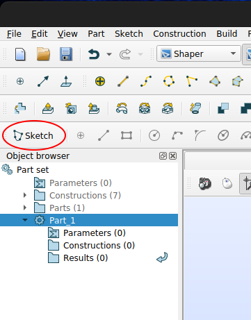
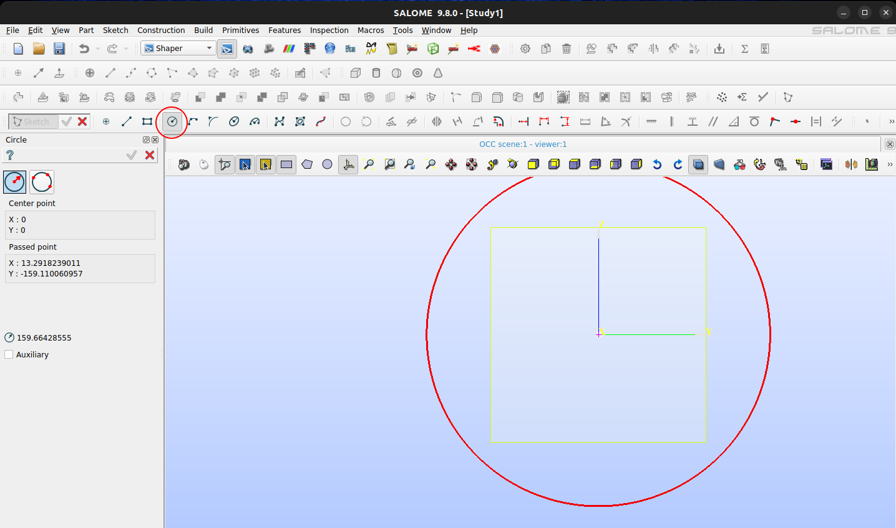
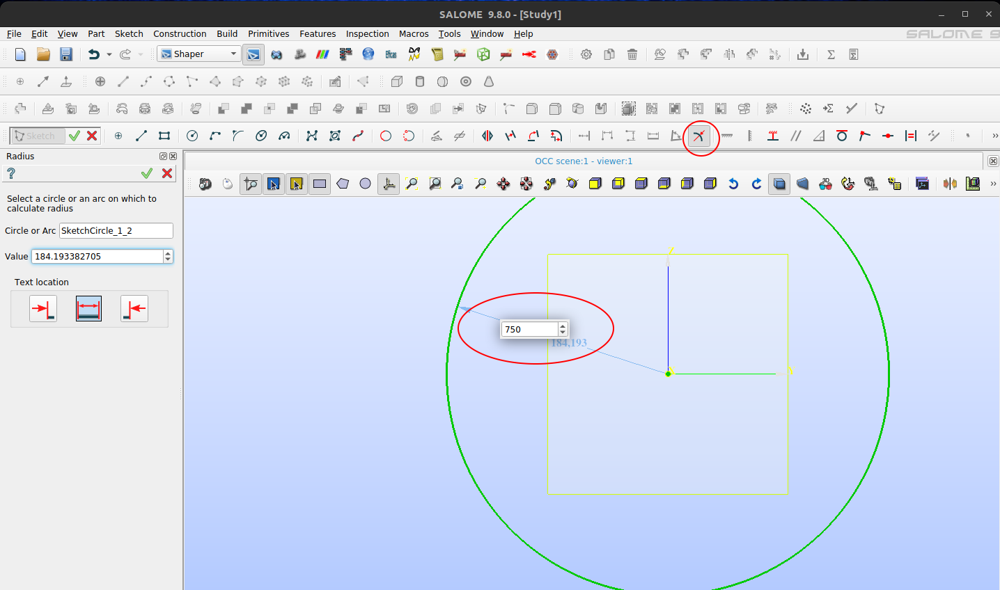
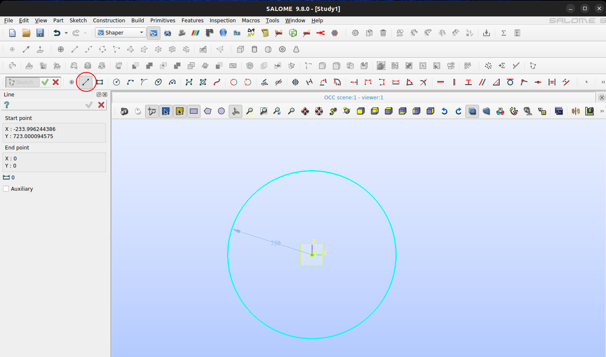
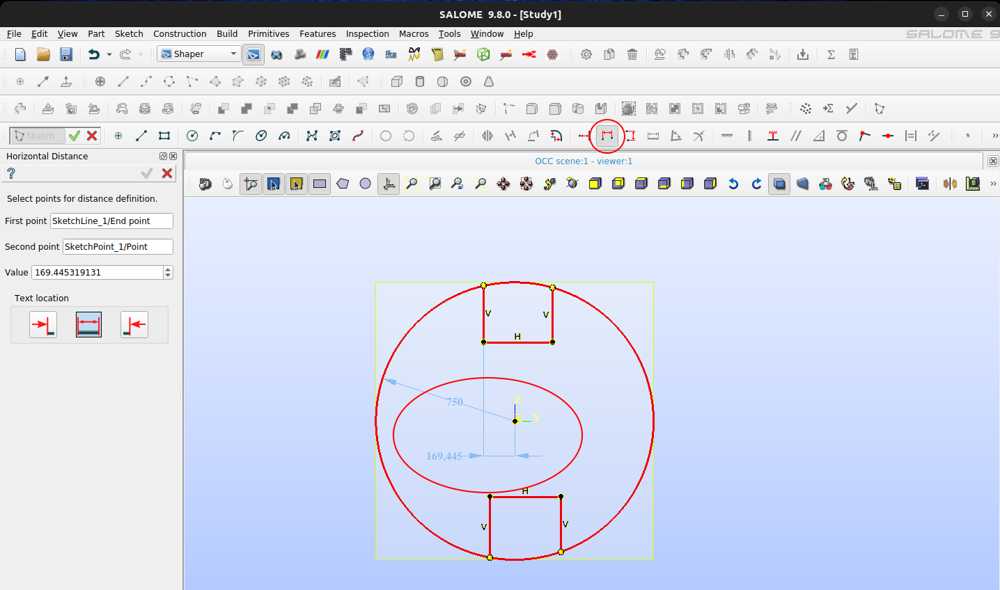
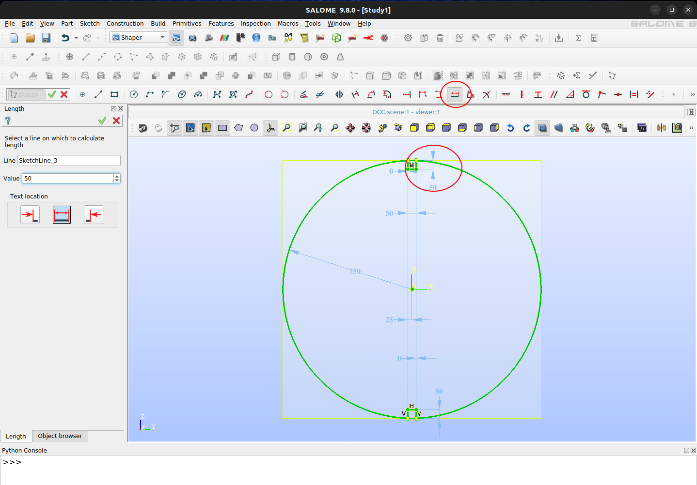
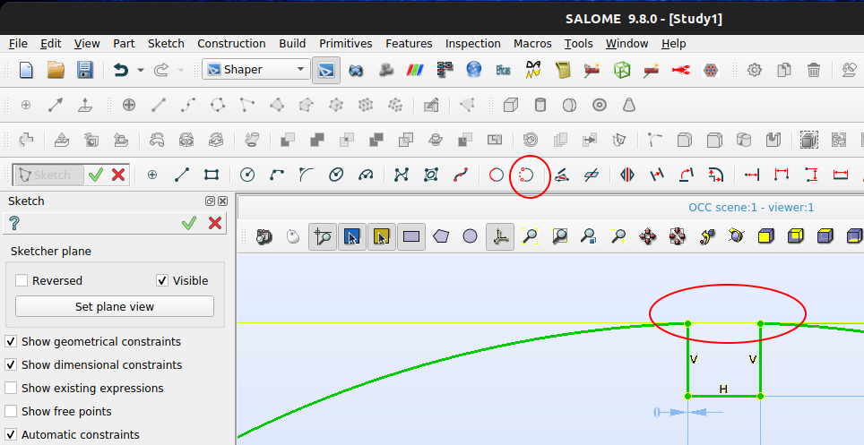
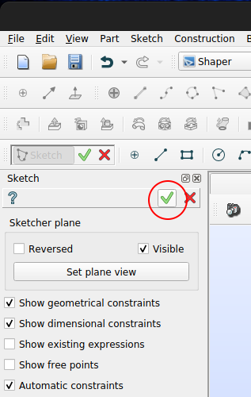
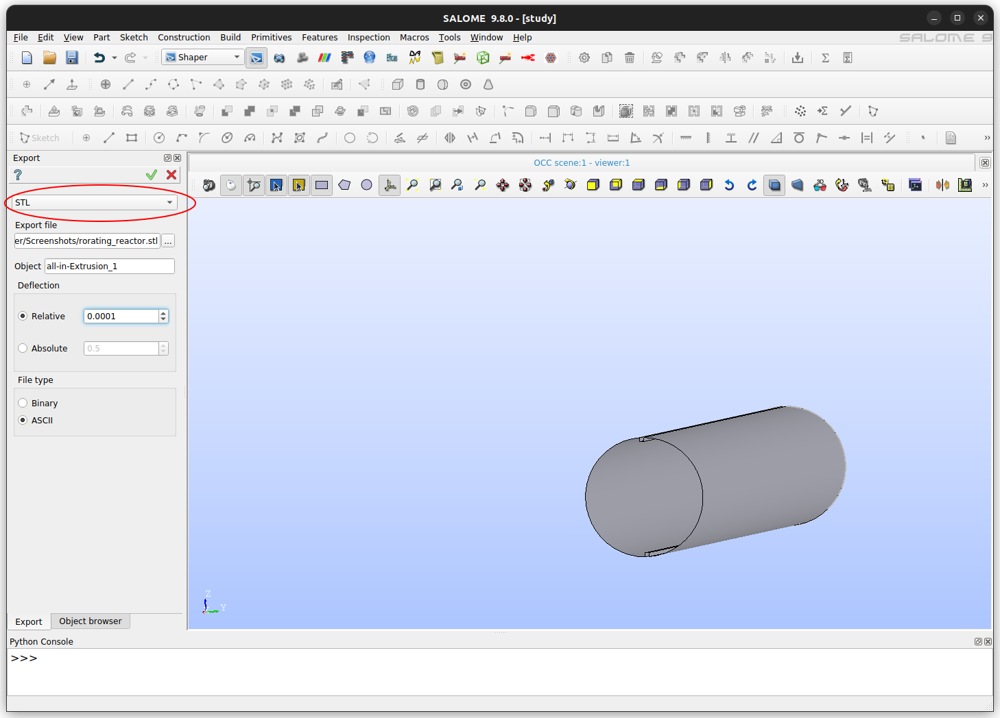

# Geometry and Preprocessing

## Computer assisted design

### [FreeCAD](https://www.freecad.org/)

- 

### [Salome](https://www.salome-platform.org/)

- [Documentation](https://docs.salome-platform.org/latest/main/gui.html)

#### Rotating reactor

In this tutorial we illustrate how to produce a STL surface for use with DEM simulation or meshing with other tools (such as `snappyHexMesh`).

The first step in Salome Shaper to create a geometry is to add a part using the button indicated below:

To add a sketch, select the created part on the object tree and click on button Sketch:

Then select the sketching plane and set plane view to start drawing:

Reactor body will be a cylinder with lifters. Here we start by drawing a circle for later extruding it. It is important to snap the center of the cylinder to the origin of coordinate systems and Salome will handle the constraint automatically.

Using the radius tool you can now constraint the size of shape. Notice that this could also employ symbolic values declarer in the dedicated manager.

Using the line tool we can draw the lifters profile. Again we can make use of Salome auto-constraning functionality by placing the cursor over the circle before starting the sketch, so that it becomes light blue. By doing this, once we try to set dimensions of the newly drawn lines, their tips will follow along the circle path.

It is also important to notice that if you draw perfectly vertical or horizontal lines, Salome Shaper will again apply auto-constraints, as depicted below:

With the horizontal distance tool you can set distances between objects:

Similarly, you can also set lengths with the adequate tool:

Using the trimming tool you can remove segments that are intercepted by points:

Once sketch is ready, you can validate to pursue 3D modeling:

Among the several possible extrusion methods, you can select to extrude only the profile. Do not forget to select the objects, direction and depth to extrude. Using auxiliary lines it is virtually possible to extrude in any direction other than perpendicular to sketch plane.

Here we are ready to go to menu `File > Export > To CAD format...` and select STL option and the path to the target file. Notice that if the design was composed of several parts, in this step you would need to export them individually by selecting one part at a time.

Now you have a reactor profile for use in a simulation setup.

## Grid generation

### [gmsh](https://gmsh.info/)

### [netgen](https://ngsolve.org/)

### [tetgen](https://wias-berlin.de/software/tetgen/1.5/index.html)

