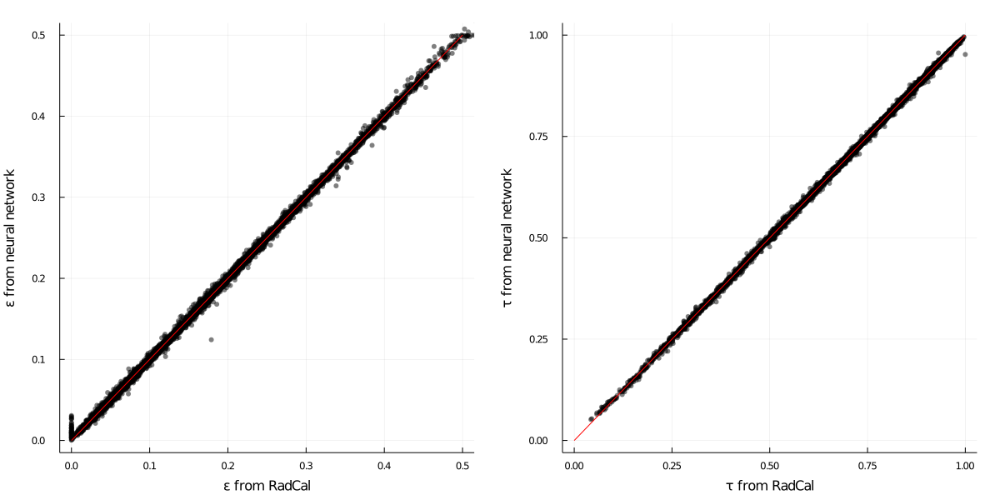

# RadCalNet

Radiation properties machine learning model trained on RadCal.

In this project we use the re-implementation of
[RadCal](https://github.com/firemodels/radcal) [Grosshandler1993](@cite) to
generate data and train a machine learning model for the prediction of radiative
properties, *i.e.* emissivity and transmissivity, of common combustion flue
gases.

This is done because for real-time calls of RADCAL might be computationally
prohibitive, for instance in CFD applications. Thus, a neural network is trained
with [Flux](https://fluxml.ai/Flux.jl/stable/) based on the simulated data and
this module provides an interface to call the network from external programs
(Ansys Fluent, OpenFOAM, ...).

For details of validity ranges and sample space, please check function
[`RadCalNet.datasampler!`](@ref), where random sampling is provided. Indexing of
species array is documented at [`RadCalNet.runradcalinput`](@ref).

Below we display the quality of fitting of model. One must notice that fitting
of emissivity still needs a few adjustments, while transmissivity is well
predicted over the whole range.



## Usage

```@meta
CurrentModule = RadCalNet
```

The following snippet illustrates everything the model was designed to do.

```jldoctest
julia> using RadCalNet;

julia> x = Float32[1200.0; 1000.0; 2.0; 1.0; 0.1; 0.2; 0.1];

julia> y = RadCalNet.model(x)
2-element Vector{Float32}:
 0.3231391
 0.6287435
```

The array of inputs `x` is defined below, and `y` provides gas emissitivy and
transmissivity, respectively. Notice that `x` must be a column vector with
entries of type `Float32`.

| Index | Quantity          | Units | Minimum | Maximum |
| :---: | :--------------:  | :---: | :-----: | :-----: |
| 1     | Wall temperature  | K     | 300     | 2500    |
| 2     | Gas temperature   | K     | 300     | 2500    |
| 3     | Depth             | m     | 0.1     | 3.0     |
| 4     | Pressure          | atm   | 0.5     | 1.5     |
| 5     | CO2 mole fraction | -     | 0.0     | 0.25    |
| 6     | H2O mole fraction | -     | 0.0     | 0.30    |
| 7     | CO  mole fraction | -     | 0.0     | 0.20    |

For practical applications, one generally is interested in calling the model
with a large inputs set. Belowe we illustrate how to do this with a block of
data and verify the predictions are within the model tolerance on average.

```jldoctest
using WallyToolbox
using RadCalNet
using Flux: mae

# Loss after last training.
LOSS = 0.0022

# Random sample data randomly extracted (20 rows).
TESTDATA = Float32[
    1670.0   960.0  1.9  0.5  0.15  0.18  0.03   0.161774   0.820025
    1230.0   320.0  1.9  1.0  0.04  0.08  0.18   0.20205    0.79694
    1760.0   770.0  2.1  1.5  0.22  0.24  0.12   0.309017   0.669564
    1770.0   960.0  1.9  0.5  0.15  0.0   0.13   0.0721235  0.919333
     350.0  1590.0  1.9  1.0  0.06  0.29  0.12   0.357215   0.169437
    2330.0  1820.0  1.1  1.5  0.13  0.08  0.13   0.100282   0.840802
    1220.0  2070.0  0.2  0.5  0.11  0.17  0.09   0.0361672  0.902581
     760.0  1380.0  1.9  1.5  0.1   0.01  0.10   0.188531   0.69798
    1870.0  1880.0  0.2  1.5  0.14  0.28  0.17   0.0819803  0.858508
    1910.0  2220.0  1.3  1.5  0.2   0.3   0.09   0.202592   0.63856
    2290.0   360.0  1.8  0.5  0.0   0.23  0.07   0.0755366  0.914045
    1330.0   640.0  1.7  1.5  0.21  0.04  0.06   0.227428   0.764363
    1090.0  1260.0  1.9  1.5  0.17  0.18  0.18   0.381407   0.501751
    1250.0  1590.0  0.4  1.5  0.13  0.27  0.18   0.191725   0.688272
     990.0  2320.0  0.5  1.0  0.23  0.27  0.03   0.118285   0.633932
    1920.0   720.0  0.3  1.0  0.05  0.03  0.18   0.0496579  0.945693
    1250.0   310.0  0.6  1.0  0.04  0.18  0.15   0.171857   0.827273
    1990.0  1020.0  1.3  1.0  0.09  0.11  0.15   0.140596   0.837042
    1180.0  1830.0  0.3  0.5  0.09  0.29  0.02   0.0682171  0.851304
    2120.0  1230.0  2.9  1.5  0.03  0.06  0.17   0.168034   0.791942
]

# Predictors and targets transposed.
X = transpose(TESTDATA[:, 1:7])
Y = transpose(TESTDATA[:, 8:9])

mae(RadCalNet.model(X), Y) <= LOSS

# output

true
```

The following test can also be seen as a tutorial for data generation, where we
make the verification of data generation with provided seed.  See
[`RadCalNet.createcustomdatabase`](@ref) for more details. An alternative
[`RadCalNet.datasampler!`](@ref) can be provided for specific problems.

```jldoctest
import Random
using WallyToolbox
using RadCalNet

function sampledatabase()
    #XXX: documentation is run from root directory!
    testname = joinpath(joinpath(@__DIR__, "src/RadCalNet/data/sample.dat"))

    # Provide a seed at start-up for *maybe* reproducible builds.
    Random.seed!(42)

    if !isfile(testname)
        RadCalNet.createcustomdatabase(;
            sampler!   = RadCalNet.datasampler!,
            repeats    = 3,
            samplesize = 3,
            cleanup    = true,
            saveas     = testname,
            override   = true
        )
    end

    return RadCalNet.loaddatabase(testname)
end

A = sampledatabase()[:, end-5:end]

# output

9×6 Matrix{Float32}:
 0.61  0.0006522    0.00680899  0.127997       1.4369f5   0.784483
 0.63  0.00147905   0.0163017   0.256072   52761.9        0.493376
 0.8   0.00181013   0.0525569   0.209679    1712.82       0.743175
 0.69  0.000962085  0.0317917   0.0917254      3.80101f5  0.88582
 0.69  0.00246231   0.0538234   0.418247    1442.63       0.479691
 0.68  0.00210072   0.00470752  0.0997078  71325.7        0.79875
 0.67  0.000770321  0.0101432   0.0812446      3.0696f5   0.815462
 0.7   0.00154008   0.0215186   0.253691   24945.7        0.478712
 0.53  0.00133843   0.0180676   0.234852   21784.6        0.7443
```

## To-do's

- Broaden sample space over the whole RadCal composition spectrum.
- Define data loading on GPU/CPU though a flag when recovering model.
- Create database for testing outside of sampling points.
- Improve model reload and organize a notebook for training.

## Literature discussion

```@setup literature
using DelimitedFiles
using HDF5
using Plots
using Printf

using WallyToolbox
import RadCalNet

function gorogcomposition()
    X = zeros(14)
    X[1] = 0.2
    X[2] = 0.2
    X[end] = 1.0 - sum(X[1:2])
    return X
end

function gorogsemissivitydata()
    pr = collect(0.0:0.015:3.2)
    Tg = [830.0, 1110.0, 1390.0]

    X = gorogcomposition()
    prod = Iterators.product(pr, Tg)
    samplesize = length(pr) * length(Tg)
    table = zeros(samplesize, 26)

    for (k, (p, T)) in enumerate(prod)
        table[k, 1:end] = RadCalNet.runradcalinput(;
            X = X,
            T = T,
            L = p / sum(X[1:2]),
            TWALL = 300.0,
            FV = 1.0e-15
        )
    end

    return table
end

function gorogsabsorptivitydata()
    pr = collect(0.0:0.01:1.6)
    Tw = [277.0, 555.0, 833.0]

    X = gorogcomposition()
    prod = Iterators.product(pr, Tw)
    samplesize = length(pr) * length(Tw)
    table = zeros(samplesize, 26)

    for (k, (p, T)) in enumerate(prod)
        table[k, 1:end] = RadCalNet.runradcalinput(;
            X = X,
            T = 1110.0,
            L = p / sum(X[1:2]),
            TWALL = T,
            FV = 1.0e-15
        )
    end

    return table
end

function plotgorogsemissitivity(εdata, εgorog)
    p = plot(dpi = 100, legend = :topleft)
    scatter!(p, εdata[1][:, 1], εdata[1][:, 2],
             markerstrokewidth = 0.0, label = "Gorog")

    for T in unique(εgorog[:, 4])
        sel = εgorog[εgorog[:, 4] .== T, :]
        pr = sum(sel[:, 8:9], dims = 2) .* sel[:, 5]
        εg = sel[:, 24]
        plot!(p, pr, εg, label = @sprintf("%4.0f K", T))
    end

    xlims!(p, 0.0, 3.2)
    ylims!(p, 0.0, 0.7)
    xticks!(p, 0.0:0.4:3.2)
    yticks!(p, 0.0:0.1:0.7)

    xlabel!(p, "Optical thickness [m-atm]")
    ylabel!(p, "Emissivity")

    p
end

function plotgorogsabsorptivitydata(αdata, αgorog)
    p = plot(dpi = 100, legend = :topleft)
    scatter!(p, αdata[1][:, 1], αdata[1][:, 2],
             markerstrokewidth = 0.0, label = "Gorog")

    for T in unique(αgorog[:, 3])
        sel = αgorog[αgorog[:, 3] .== T, :]
        pr = sum(sel[:, 8:9], dims = 2) .* sel[:, 5]
        αg = 1.0 .- sel[:, end]
        plot!(p, pr, αg, label = @sprintf("%4.0f K", T))
    end

    xlims!(p, 0.0, 1.6)
    ylims!(p, 0.0, 1.0)
    xticks!(p, 0.0:0.2:1.6)
    yticks!(p, 0.0:0.2:1.0)

    xlabel!(p, "Optical thickness [m-atm]")
    ylabel!(p, "Absorptivity")

    p
end
```

### Verification agains Gorog's paper

Below we compare computed values with those by Gorog et al. [Gorog1981a](@cite).
Reference paper is found [here](https://doi.org/10.1007/BF02674758).

```@example literature
εfile = joinpath(@__DIR__, "data/emissivity.csv")
εdata = readdlm(εfile, ',', Float64, header = true)
εgorog = gorogsemissivitydata()
plotgorogsemissitivity(εdata, εgorog)
```

```@example literature
αfile = joinpath(@__DIR__, "data/absorptivity.csv")
αdata = readdlm(αfile, ',', Float64, header = true)
αgorog = gorogsabsorptivitydata()
plotgorogsabsorptivitydata(αdata, αgorog)
```

At least qualitative agreement is found and orders of magnitude are right. On
the other hand, using directly the model parameters from Tam [Tam2019](@cite) do
not produce the expected results (not displayed, work in progress in this
[draft](data/tam2019.jl)). It is not clear how the data is pre- and
post-processed for use with their network.

## All interfaces

```@autodocs
Modules = [ RadCalNet ]
```
