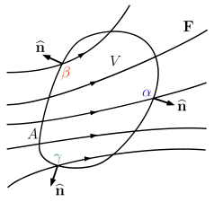
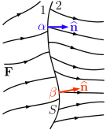

# Continuum Mechanics

---
## Analysis of transport phenomena

Theses notes intend to provide in a very concise way overview of the mathematical fundamentals of transport phenomena. In this sense, they are devoted to generalities rather than specific closure models. You can even see them as a cheat-sheet or simple lecture notes. 

In that sense, they try to be straightforward and mostly self-contained in the fundamental topics, with increased reference to external sources in applied subjects. They were first redacted based on the MITx series [Analysis of Transport Phenomena by Pr. Dr. Martin Bazant](https://mitxonline.mit.edu/courses/course-v1:MITxT+10.50.CH01x/) and further extended based on several sources cited along the way. 

The main goal is to provide a general approach of transport phenomena applied to Materials Science and Process Engineering, but readers of other fields might also be interested in parts of the contents.

*Note:* this is still a work in progress and quickly evolving. Please [let me know](mailto:walter.dalmazsilva.manager@gmail.com) if you found any typos or conceptual mistakes. I am still to ask some friends to review them.

### Transport phenomena foundations

Most physical phenomena are actually discrete processes (particles); many phenomena such as heat transfer are actual discrete vibrations in materials. Such systems are described by large systems of coupled ordinary differential equations (ODE's) which quickly become intractable and require numerical solution. Continuum approximations, *i.e.* an averaging process over a representative volume element (RVE), are used to generate a *single* partial differential equation (PDE) from *many* such ODE's. This transformation leads to the concept of *conservation equations*.

Say we have a quantity $b$ such as it represents a number $\#$ concentration of a given physical quantity. Associated to this quantity we have a flux density $\vec{F}$ through the boundaries of the system and a rate production in volume $B_v$ as summarized in the following table.

$$
\begin{align*}
b &= \dfrac{\#}{\text{volume}}                 &\qquad\text{concentration}  \\
\vec{F} &= \dfrac{\#}{\text{area}\cdotp{}\text{time}} &\qquad\text{flux density}   \\
B_{v} &= \dfrac{\#}{\text{volume}\cdotp{}\text{time}} &\qquad\text{production rate}
\end{align*}
$$

### General conservation equation

Using the above definitions and the conventions presented in the next figure, the most general statement of conservation of this quantity $b$ writes then:

$$
\frac{d}{dt}\left(\int_{V}bdV\right) = -\int_{\Omega}\vec{n}\cdotp\vec{F}dA+\int_{V}B_{v}dV
$$

Using the previous notation for units it is important to notice that each term of the above equation is given in units of *quantity* $\#$ per volume per time.

#divergence-theorem

This multivariate vector equation describe transport in three-dimensional space. To be able to process further this expression one needs to incorporate the **divergence theorem** ideas to be able to formulate it in terms of volume only.

Say we have the vector field $\vec{F}$, represented above by a number of lines; this could be any flow of some conserved quantity in the system being analyzed, as we shall see later. A control volume (CV) with a volume of $V$ and a surface area of $A$ is illustrated with a boundary $\Omega$ denoted by the outward pointing unit normal $\hat{n}$ at each point on the surface. The **divergence theorem** states:

$$
\int_{V}\nabla\cdotp{\vec{F}}dV=\int_{\Omega}\vec{n}\cdotp\vec{F}dA
$$

In this expression,   $\nabla\cdotp\vec{F}$ at each interior point inside $V$ – a scalar quantity – gives the rate at which the conserved quantity *spreads out* from that point, while $\hat{n}\cdotp\vec{F}$ at each boundary point on $A$ – also a scalar quantity – gives the rate at which the conserved quantity *leaks out* at that point. Thus we may summarize the divergence theorem by saying that there are two equally valid ways to compute the _total_ rate at which the conserved quantity leaves the control volume: either by integrating $\nabla\cdotp\vec{F}$ at each _interior point_ over $V$, or by integrating $\hat{n}\cdotp\vec{F}$ at each _boundary point_ over $A$. Using this ideas the previous conservation law can be converted into:

$$
\frac{d}{dt}\left(\int_{V}bdV\right) = -\int_{V}\nabla\cdotp{\vec{F}}dV+\int_{V}B_{v}dV
$$

Assuming an Eulerian reference frame (fixed) to the volume $V$ we can move the time derivative of the above expression inside the left-hand side integral. Rearranging we have

$$
\int_{V}\left(\frac{\partial{}b}{\partial{}t} + \nabla\cdotp{\vec{F}} - B_{v}\right)dV = 0
$$

For a differential volume $dV$ the integrand must be identically zero, from which the PDE arise:

$$
\frac{\partial{}b}{\partial{}t} + \nabla\cdotp{\vec{F}} - B_{v} = 0
$$

Physically speaking this expression simply puts that the rate of accumulation equals the inflow (notice that this assumes a balance according to normal vector convection established above) plus the rate of production inside the control volume. This expression serves as the basis to the governing equations of different transport phenomena when **constitutive relationships** are included for describing a certain physics.

### Conservation at system boundaries

So far we have a PDE describing the conservation *inside* the RVE of the system being described. To be able to solve such a system we also need to provide a description of its interactions with its surroundings through the specification of *boundary conditions*.

Assume a volume of thickness $l$ enclosing a boundary $S$ splitting domains $V_{1}$ and $V_{2}$, where discontinuities in properties and all quantities describing the system may be present. We can write the continuity equation for this *thick* boundary as

$$
\frac{d}{dt}\left(\int_{V}bdV\right) = -\int_{\Omega}\vec{n}\cdotp\vec{F}dA+\int_{V}B_{v}dV+\int_{\Omega}B_{s}dA
$$

where the last term has been added to describe the net surface production rate of $b$. Collapsing the volume over the boundary $S$ by taking the limit where $l\to{}0$, it should be evident that all volume integrals in the above vanish. The integral form of boundary condition then simplifies to

$$
\int_{\Omega}\vec{n}\cdotp\vec{F}dA=\int_{\Omega}B_{s}dA
$$

Defining as positive the normal of $S$ pointing outwards $V_{1}$ the integrant on right-hand side can be written as $\vec{n}\left(\vec{F}_{2}-\vec{F}_{1}\right)$. Applying mean value theorem as if all terms where in the same side of the equation (that vanishes overall) leads to the differential form of boundary condition

$$
\vec{n}\left(\vec{F}_{2}-\vec{F}_{1}\right)=B_{s}
$$

This expression has a very straightforward interpretation. If there is no creation rate $B_{s}$ at the interface, flux is continuous across interface; otherwise some arbitrary form of discontinuity should arise, whose form would depend on the volume governing equations at each side of $S$. Below we have an illustration of a non-zero value of $B_{s}$ at the interface, with a net increase in the flow in region 2.

> [!todo] The following is something I need to abstract better, although I fully understand the mathematical origins. The argument that it is formulated in the interface reference frame but viewed from the observer frame bothers me.
	
In the case of moving interfaces, the previous formulation needs to account for the relative motion of the boundary and the associated fictitious fluxes that follow it. In the interface reference frame, a relative flux $b_{i}\vec{v}_{s}$ needs to be accounted for, resulting in the modified boundary condition

$$
\vec{n}\left(\vec{F}_{2}-b_{2}\vec{v}_{s}\right)-\vec{n}\left(\vec{F}_{1}-b_{1}\vec{v}_{s}\right)=B_{s}
$$

From this condition it arrises that the magnitude of the normal component of the interface velocity is constrained to the following expression. No matter what physics is governing the movement, this compatibility constraint must be verified.

$$
v_{s} = \frac{\vec{n}\left(\vec{F}_{2}-\vec{F}_{1}\right)-B_{s}}{b_{2}-b_{1}}
$$

> [!todo] In the growing and shrinking bubble example, Pr. Bazant comes up with a variant of this expression where the fluxes are given by $\rho{}v$, but I cannot realize how can the velocity $v_{1}\neq{}v_{2}\neq{}v_{s}$ in this case.

For instance, consider the case that $\vec{F}_{2}-\vec{F}_{1}=0$ and $B_{s}<0$, then the interface is consuming $b$; because the quantity cannot be supplied through fluxes, then the interface $S$ moves towards the side richer in $b$.

> [!todo] Complete this paragraph with water solidification example.

---
## Mass and energy transfer

### Derivation of conservation equations

In the nineteenth century, Fick demonstrated *empirically* that the flux density of a species submitted to gradient field responded linearly to its concentration $c$ gradient. Notice here $c$ takes the place of the more general $b$ in the conservation form derivation. In the more general case we should use subindexes for species concentrations and diffusivities, but that will be neglected here.

$$
\vec{F}\propto{}-\nabla{}c
$$

This is actually the simplest form of diffusion modeling and, in general, is valid only in very specific cases, *i.e.* when a single species is being transported in a system without the effect of other components. Introducing a proportionality coefficient $D$, the diffusivity, we have:

$$
\vec{F}=-D\nabla{}c
$$

Using this expression in our conservation equation leads to:
  
$$
\frac{\partial{}c}{\partial{}t} - \nabla\cdotp{\left(D\nabla{}c\right)} - R_{v} = 0
$$

Under the very specific case where there is no volumetric production rate $R_{v}$, *i.e.* no chemical reactions, and constant diffusivity $D$, *i.e.* no composition or space dependence, this simplifies to the well-studied form of the so called Fick's second law:

$$
\frac{\partial{}c}{\partial{}t} = D\nabla^{2}{c}
$$

This expression happens to be isomorph with heat diffusion equation for a constant specific heat medium because Fourier's law is analogous to Fick's first law, leading to the same final mathematical form. Using the thermodynamic definition $dh=\rho{}c_{p}dT$ we have

$$
\frac{\partial{}T}{\partial{}t} = \frac{k}{\rho{}c_{p}}\nabla^{2}{T}
$$

It must be noticed that in the general case, the quantity being transported in heat equation is the enthalpy density $h$ and the potential field is linearized in terms of temperature $T$ through Fourier's equation. Without the constant specific heat simplification and with variable thermal conductivity $k$ it is stated as:

$$
\frac{\partial{}h}{\partial{}t} = \nabla\cdotp\left(k\nabla{T}\right)
$$

Other than for very simple enthalpy-specific heat relationships (such as the constant approximation discussed above), this PDE must be solved numerically with a coupled system of nonlinear equations for computing the field of temperatures in terms of enthalpies. In the above we neglect the volumetric heat production rate, which would be present, *e.g.* in a reacting system or a material undergoing nuclear fission.

### Formulation of boundary conditions

When dealing with mass and heat transfer in the absence of more *exotic* physics such as electromagnetic effects, a pair of possible descriptions for the boundary fluxes arise; the first must be provided as a closure model for the surface species production rates $R_{s}$ for mass transfer, and heat generation rate $q_{s}$ for heat transfer; the other possibility is to assume the medium outside of the modeled domain is a *reservoir* with constant $b_{\infty}$, the the proper $b$ depending on the phenomena being described. The latter is generally modeled through a constitutive law under the form $\vec{F}=h\left(b-b_{\infty}\right)$, where $h$ is introduced as a transfer coefficient.

$$
-\vec{n}\cdotp{}D\nabla{}c=
\begin{cases}
R_{s}\\[6pt]
h_{m}(c-c_{\infty})
\end{cases}
\qquad\text{and}\qquad
-\vec{n}\cdotp{}k\nabla{}T=
\begin{cases}
q_{s}\\[6pt]
h_{e}(T-T_{\infty})
\end{cases}
$$

The actual meaning of $h$, be for mass transfer $h_{m}$ or energy $h_{e}$ depends of the physics being approximated in the external reservoir. There are specific, generally (semi-)empirical methods for evaluating reasonable values for the analysis of their values; this will be the subject of a future topic because the current context is still focused in general principles.

As a side note, it is worth mentioning here that in analytical methods the $b_{\infty}$ is treated as constant because otherwise analysis could grow exponentially in complexity. For the numerical solution of models it can be often treated as an explicit time function. For instance, imagine a material treatment where pulses of a reacting species are controlled and their concentration in the reactor is known in time; if modeling the solid state uncoupled from the reactor - what is generally the case due to computational time limitations - then the value of $b_{\infty}$ can be provided explicitly, keeping in mind that $h$ can also be a function of this value or surface concentration, depending on the closure model used for the specific simulation.

### Microscopic models of diffusion

The models discussed so far are in fact the macroscopic response to discrete phenomena happening at the atomic and molecular scales. Particles moving randomly due to thermal energy in a fluid or solid follow a path described by a probability density function in steps that in most cases happen at a typical rate due to these thermal fluctuations.

#### Diluted mixtures

In the most simple of cases, a *non-interacting particle* in a dilute mixture performs a *random walk*; when many such particles are present in one part of the domain, as we will show later, the resulting gradient of concentration that will be established over a sufficiently large amount of time leads to Fick's law. The terminology was created by [Pearson (1905)](https://www.nature.com/articles/072294b0) for which [Rayleigh (1905)](https://www.nature.com/articles/072318a0) had already found a solution many years beforehand; is also appears in the solution of Brownian motion by [Einstein (1905)](https://myweb.rz.uni-augsburg.de/~eckern/adp/history/einstein-papers/1905_17_549-560.pdf) (translated [here](https://www.damtp.cam.ac.uk/user/gold/pdfs/teaching/old_literature/Einstein1905.pdf)) and turbulent diffusion by [Taylor (1922)](https://courses.washington.edu/mengr537/Lecture_Notes/DiffusionContinuousMovements_TaylorDispersion_ProcMathSocLon1921.pdf).

In the derivation of diffusion equation, following the already mentioned *non-interacting particles* hypothesis, one also needs steps to be *independent, identically distributed* (IDD) and limited by a *finite variance* $\sigma^{2}$, *i.e.* $p(x\pm{}K\sigma)\to{}0$ quickly for some finite $K$.

$$
P_{N+1}(x) = \int{}P_{N}(x-y)p(y)dy = (P_{N} \ast p)(x)
$$

> *The probability $P_{N+1}(x)$ that a particle is found at $x$ at step $N+1$ is equal to the sum of the probabilities $p(y)$ of particles at a distance $y$ from $x$ execute a movement of such amplitude to reach $x$ times the probability of a particle being at the position $P_{N}(x-y)$.*

$$
P_{N} = (P_{0} \ast p \ast p \ast \dots p)(x) = (P_{0} \ast p^{\ast{}N})(x)
$$

$$
\begin{align*}
P_{N+1}(x)
&= \int{}\left(P_{N}(x) - yP_{N}^{\prime}(x) + \dfrac{1}{2}y^{2}P_{N}^{\prime\prime}(x)\right)p(y)dy\\
%
&=P_{N}(x)\int{}p(y)dy - P_{N}^{\prime}(x)\int{}yp(y)dy + \dfrac{1}{2}P_{N}^{\prime\prime}(x)\int{}y^{2}p(y)dy\\
%
&=P_{N}(x) - \langle{}y\rangle{}P_{N}^{\prime}(x) + \dfrac{1}{2}\langle{}y^{2}\rangle{}P_{N}^{\prime\prime}(x)
\end{align*}
$$

The fourth and last requirement now is that process take place with a *finite mean step $\langle\tau\rangle$*:

$$
\dfrac{P_{N+1}(x) - P_{N}(x)}{\langle\tau\rangle} + \dfrac{\langle{}y\rangle{}}{\langle\tau\rangle}P_{N}^{\prime}(x) = \dfrac{\langle{}y^{2}\rangle{}}{2\langle\tau\rangle}P_{N}^{\prime\prime}(x)
$$

Introducing $c(x-vt,t)\sim{}P_{N}(x-vt)$ with $t=N\langle\tau\rangle$

> [!todo] Finish the additional Taylor expansion from the above expression to get formally to the final result provided below.

$$
\dfrac{\partial{}c}{\partial{}t} + v\dfrac{\partial{}c}{\partial{}x} = D\dfrac{\partial^{2}c}{\partial{}x^{2}}
%
\quad\text{where}\quad{}v=\dfrac{\langle{}y\rangle}{\langle\tau\rangle}
%
\quad\text{and}\quad{}D=\dfrac{\langle{}y^{2}\rangle-\langle{}y\rangle^{2}}{2\langle\tau\rangle}
$$

> [!info] More about this in chapter 4 of ([[@Mehrer2007]]).

#### Concentrated mixtures

On the other limit one finds the concentrated mixtures for which particle-particle interactions intervene on the probability distribution of motion and results obtained through *non-equilibrium thermodynamics* lead to a more complex law. Particle interactions may be simple collisions or involve more complex physics, such as electrodynamic forces; a direct solution through statistical approaches in this case quickly becomes intractable mathematically.

In what follows we will derive the diffusion equation from the aforementioned thermodynamic principles. The chemical potential is defined as the *sensitivity* of Gibbs free energy $G$ with respect to the number of moles $N$ of a substance. Expressed in terms of activity $a$ we have:

$$
\mu = \dfrac{\partial{}G}{\partial{}N}=\mu^{\theta}+k_{B}T\ln(a)
$$

The activity of non-ideal solutions is itself a function of a relative concentration $\tilde{c}$ through a proportionality coefficient $\gamma$, the so-called activity coefficient, which by its turn can also be a function of composition. The reference concentration $c_{sat}$ to the definition of $\tilde{c}$ is the concentration at which a phase change happens; that said, the activity may be seen as a measure of the *tendency* towards phase change. This is all expressed as

$$
a=\gamma\tilde{c}\qquad\text{where}\qquad\tilde{c}=\dfrac{c}{c_{sat}}
$$

Now let's Einstein relationship between mobility $M$ and the diffusivity $D$. Mobility is defined as the capacity a given force is able to produce a net drift velocity in the system; it is related to $D$ as

$$
M = \dfrac{\text{drift velocity}}{\text{force}} =\dfrac{D}{k_{B}T}
$$

From *linear irreversible thermodynamics* (LIT) we can express the flux as

$$
\vec{F}=-Mc\nabla{}\mu=\vec{v}_{drift}c\qquad\text{where}\qquad{}\vec{v}_{drift} = -M\nabla\mu
$$

> [!info] The development of (LIT) is found in ([[@Onsager1931]]) and the following ([[@Onsager1931a]]). Notice that the above paragraph needs more grounding, it has been thrown in the text as a truth without first-principles demonstration and that is against our goals here!

Because $\log(\tilde{c})=\log(c)-\log(c_{sat})$ and $c_{sat}$ is a constant, then developing $\nabla\mu$ leads to

$$
\nabla\mu = k_{B}T\left(\dfrac{1}{c}+\dfrac{1}{\gamma}\dfrac{\partial\gamma}{\partial{}c}\right)\nabla{}c
$$

Applying this result to the previous expression and reworking the terms leads to

$$
\vec{F}=-D\left(1 + \dfrac{c}{\gamma}\dfrac{\partial\gamma}{\partial{}c}\right)\nabla{}c=-D\left(1 + \dfrac{\partial\ln\gamma}{\partial\ln{}c}\right)\nabla{}c
$$

Here we can identify the chemical diffusivity by comparison with Fick's law as

$$
D_{chem} = -D\left(1 + \dfrac{\partial\ln\gamma}{\partial\ln{}c}\right)
$$

In the above expression, the second term in the sum is called the *thermodynamic factor*. In the limit of dilute system for which $\gamma=1$ we fall back to $D_{chem}=D$, showing that the concentrated mixture approach is a proper generalization of the previous model for diluted systems.

### Application to diffusion in a lattice

---
## Fluid mechanics

### Derivation of continuity equation

Moving towards a fluid mechanics application, one often needs to express the *continuity* equation for the overall mass of the system and the flowing species.

In this case, term $b$ of previous formulation is replaced by the mass density $\rho_{m}$ of the fluid. Flux is expressed as $\vec{F}_{m}=\vec{v}_{m}\rho_{m}$, where $\vec{v}_{m}$ is the mass averaged velocity. It is useful to introduce this quantity $\vec{v}_{m}$ because in many multi-species formulations it might become difficult to find a single velocity representing the fluid motion.

In the absence of creation rates $B_{v}$ the continuity equation writes

$$
\frac{\partial\rho_{m}}{\partial{}t}+\nabla\cdotp\left(\rho_{m}\vec{v}_{m}\right)=0
$$

For incompressible flows (constant $\rho_{m}$) the time derivative is by definition null and the divergent term can be expanded in terms of its components gradients as

$$
\nabla\cdotp\left(\rho_{m}\vec{v}_{m}\right)=\rho_{m}\nabla\vec{v}_{m}+\vec{v}_{m}\nabla\rho_{m}=0
$$

#incompressible-flow

Since $\rho_{m}$ is constant, this simplifies to the so-called *incompressible fluid continuity equation*

$$
\nabla\vec{v}_{m}=0
$$

### Application to advection-diffusion-reaction

Now assume a flow where chemical species $c_{i}$ are advected by the velocity $\vec{v}_{i}$ and diffuse following the negative of their gradient. The flux in this case is given as $F_{i} = c_{i}\vec{v}_{i}-D_{i}\nabla{}c_{i}$. Applying this to the equation of conservation of $c_{i}$ leads to

$$
\frac{\partial{}c_i}{\partial{}t}+\nabla\cdotp\left(c_{i}\vec{v}_{i}-D_{i}\nabla{}c_{i}\right)=R_{v}
$$

Splitting the terms under the divergence operator in right-hand side and reorganizing:

$$
\frac{\partial{}c_i}{\partial{}t}+\nabla\cdotp\left(c_{i}\vec{v}_{i}\right)=\nabla\cdotp\left(D_{i}\nabla{}c_{i}\right)+R_{v}
$$

It is often beneficial to further expand the divergence of convection term so that the equation can be reshaped as follows:

$$
\frac{D{}c_i}{D{}t}=
\frac{\partial{}c_i}{\partial{}t}+
\vec{v}_{i}\nabla{}c_{i}=
\nabla\cdotp\left(D_{i}\nabla{}c_{i}\right)-
c_{i}\nabla\cdotp\vec{v}_{i}
+R_{v}
$$

In this expression the *big-D* notation represents a material or convective derivative. It provides us the behavior of transported quantity in the fluid reference frame, what can be useful for some local analysis. Even more useful than that, under this form we can promptly simplify the remaining terms in the left-hand side for cases of constant diffusivity, incompressible flow, and absence of chemical reactions (in the order of appearance of terms). For numerical solution of transport equations for incompressible flows, using the null divergent of velocity can save us a lot of trouble.

---
## Notes by video lecture

The playlist with all lectures is found [here](https://www.youtube.com/playlist?list=PLkdIY_5Zxa7WYkMvY48WQIxSZE-bI7R4w).

### 019

#reaction-diffusion

The scale estimates of penetration depth, boundary flux, and total concentration match the analytical values for steady-state first order linear reaction-diffusion equation submitted to a Dirichlet condition on one side of a semi-infinite medium:

$$
D\dfrac{\partial^{2}C}{\partial{}x^{2}}-kC=0\implies\begin{cases}
\delta     &\sim& \sqrt{\dfrac{D}{k}}\\[12pt]
%
F          &\sim& C_{0}\sqrt{Dk}\\[12pt]
%
C_{\infty} &\sim& C_{0}\sqrt{\dfrac{D}{k}}
\end{cases}
$$

### 020

#dimless-damkohler

Damköhler number arises from reaction diffusion-equation discussed in lecture 019; we can make the equation dimensionless by making $\tilde{x}=xL^{-1}$, $\Theta=C/C_0$, and dividing everything by $k$, then we can define:

$$
\dfrac{\partial^{2}\Theta}{\partial{}\tilde{x}^{2}}-\mathrm{Da}\Theta=0
%
\quad\text{where}\quad
%
\mathrm{Da}=\frac{k}{D}L^2=\left(\frac{L}{\delta}\right)^2
$$

Limiting cases are:

- $\mathrm{Da}\ll{}1$: fast diffusion limit, length scale $\delta$ is much larger than $L$, so diffusion *crosses* the domain; interaction of diffusion fronts is possible. On may be interested in *e.g* computing the deviation from surface concentration $C_0$ at the body core, $\Delta{}C/C_0\sim{}\sqrt{\mathrm{Da}}$.

- $\mathrm{Da}\gg{1}$: fast reaction-limited transport; a thin layer of reaction products limits the affected depth and diffusion layer is thin beyond that. The relative amount of material that diffuses with respect to the other limiting case is $C/(C_0L^{d-1})\sim{}1/\sqrt{\mathrm{Da}}$.

### 021

In fact it is in this lecture that the stripping of dimensions of the equation as presented above in 020 is formalized; *do not even try to solve a problem before making it dimensionless*. The general procedure for making differential operators dimensionless is summarized as follows:

$$
\tilde{x}_{i} = \dfrac{x_{i}}{L_{i}} \implies
%
\begin{cases}
\dfrac{d}{d\tilde{x}_{i}}&=&L_{i}\dfrac{d}{dx_{i}}\\[12pt]
\dfrac{d^{n}}{d\tilde{x}_{i}^{n}}&=&L_{i}^{n}\dfrac{d^{n}}{dx_{i}^{n}}\\[12pt]
\end{cases}
$$

### 022

#bessel-function

*Always start any modeling with the simplest geometry that captures the basic features of the system being modeled; e.g. when expanding a solution of reaction-diffusion into exponential terms, it is worth noticing that they can be replaced by hyperbolic functions, and since $\sinh$ breaks the symmetry, that term may be eliminated already during constant identification from boundary conditions*.

### 023

#dimless-peclet #plug-flow #convection-diffusion

Similarly to lecture 019, here we develop convection-diffusion equation instead; in this case the flux of a transported concentration $C$ is given by the following expression: 

$$
\vec{F}=\vec{u}C-D\nabla{}C
$$

Applying the general conservation law to steady state and incompressible ($\nabla\vec{u}=0$) gives:

$$
\vec{u}\cdotp\nabla{C}-D\nabla^{2}C=0
$$

Using the same approach to make the equation dimensionless as in lecture 019 we have:

$$
\begin{align*}
\dfrac{D}{L^2}\tilde{\nabla}^{2}\Theta-\dfrac{u}{L}\tilde{\nabla}\Theta&=0\\[12pt]
\dfrac{1}{\tau_{d}}\tilde{\nabla}^{2}\Theta-\dfrac{1}{\tau_{c}}\tilde{\nabla}\Theta&=0\\
\end{align*}
$$

where $\tau_c$ is the characteristic convection time and $\tau_d$ the characteristic diffusion time; to reach the final dimensionless equation we can multiply the whole equation by $\tau_d$, what introduces the ratio of diffusion to advection times, commonly called the Péclet number. The results may be summarized as

$$
\tilde{\nabla}^{2}\Theta-\mathrm{Pe}\tilde{\nabla}\Theta=0
\implies
\begin{cases}
\delta      &\sim& \dfrac{D}{u}\\[12pt]
\mathrm{Pe} &=& \dfrac{uL}{D}
\end{cases}
$$

In the limiting case of $\mathrm{Pe}\gg{1}$ diffusion is much slower than convection and the flow can be approximated as purely advective; this characterizes the plug-flow regime.

### 024

### 025

### 026

#dimless-peclet #plug-flow #convection-diffusion
 

### 027

### 028

### 029

### 030

### 031

