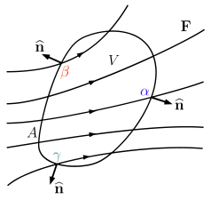

# Exercises

## The divergence theorem

In this chapter, we will derive the various **conservation equations** that provide the basis for problem solving in transport phenomena. These equations are generally written in multivariable calculus notations for transport in the three-dimensional space. This tutorial serves as a refresher of concepts in multivariable calculus, particularly the **divergence theorem**.

In the figure above,  $\mathbf{F}$ is a vector field represented by a number of field lines. We will consider a control volume (CV) in this space with a volume of $V$ and a surface area of $A$. Denoting the outward pointing unit normal at each point on the surface by $\hat{n}$, the **divergence theorem** states:

$$
\int_{V}\nabla\cdotp\mathbf{F}dV = \oint_{A}\hat{n}\cdotp\mathbf{F}dA
$$

In informal language, we may suppose that $\mathbf{F}$ indicates the *flow* of some conserved quantity. Then,  $\nabla\cdotp\mathbf{F}$ at each interior point inside $V$ – a scalar quantity – gives the rate at which the conserved quantity *spreads out* from that point, while $\hat{n}\cdotp\mathbf{F}$ at each boundary point on $A$ – also a scalar quantity – gives the rate at which the conserved quantity *leaks out* at that point.

According to the divergence theorem, there are two equally valid ways to compute the _total_ rate at which the conserved quantity leaves the CV: either by integrating $\nabla\cdotp\mathbf{F}$ at each _interior point_ over $V$, or by integrating $\hat{n}\cdotp\mathbf{F}$ at each _boundary point_ over $A$.

